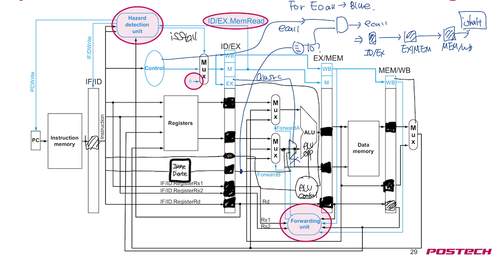
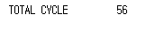

# 2022 Computer Architecture Lab 4.1
#### 20180085 컴퓨터공학과 송수민
## I. Introduction
    Lab 4.1에서는 CPU Pipeline 중 non-control flow instruction datapath를 구현한다. 이전과는 다르게 한 Cycle마다 instruction을 fetch하고자 하기 때문에 data dependency가 생기는 경우가 존재한다. 이를 처리하기 위해서 두 가지의 방법을 택할 수 있다.
    첫번째 방법으로는 data dependency가 모두 해소될 때까지 뒤의 instruction을 stall하는 것이다. 이렇게 한다면 data dependency가 많다면 pipeline으로 얻고자 하는 이점을 얻지 못할 것이다. 
    두번째 방법으로는 forwarding을 사용하여 준비된 value를 다음 instruction으로 넘겨주는 방법이다. 다만, load instruction 뒤에 data dependency가 존재 할 경우 1 stall이 불가피하다.
    이번 과제에서 Data Forwarding을 사용하여 non-control flow Pipelined CPU를 구현하고자 한다.
## II. Design
    Design은 Lecture Note 8(page 29)를 토대로 하였다. 

## III. Implementation
    다음은 구현 방법이다. 
    
- 1. PC <br>
 ```verilog    
module PC(input reset, input clk, input pc_write, input [`word_size-1:0] next_pc, output reg [`word_size - 1: 0] current_pc);
    always @(posedge clk) begin
        if(reset)
            current_pc <= `word_size'd0;
        else begin
            if(pc_write) 
                current_pc <= next_pc;   
        end
    end 
endmodule
```
> PC는 clock이 posedge일 때 synchronously update하도록 구현하였다. 모듈 구현 방법은 Single cycle CPU와 크게 다른점은 없으며, data dependency가 존재하여 stall이 필요할 때는 다음 pc로 update되면 안되기 때문에 pc_write가 1일 경우에만 update를 진행하는 방식으로 통제한다. Stall일 경우 pc_write는 0이다.
- 2. RegisterFile, Memory, Immediate
> RegisterFile,Memory는 제공된 것을 사용하였으므로 생략한다. ImmediateGenerator는 multi-cycle cpu와 같은 모듈을 사용하였다. 
- 3. ALU
```verilog
module ALU(input [3:0] alu_op, input [`word_size-1:0] alu_in_1,
input [`word_size-1:0] alu_in_2,output reg [`word_size-1:0] alu_result,output reg alu_bcond);
    always @(*) begin
        case(alu_op)
            `ALU_ADD : alu_result = alu_in_1 + alu_in_2;
            `ALU_SUB : alu_result = alu_in_1 - alu_in_2;
            `ALU_SLL: alu_result = alu_in_1 << alu_in_2[4:0];
            `ALU_XOR: alu_result = alu_in_1 ^ alu_in_2;
            `ALU_OR: alu_result = alu_in_1 | alu_in_2;
            `ALU_AND: alu_result = alu_in_1 & alu_in_2;
            `ALU_SRL: alu_result = alu_in_1 >> alu_in_2[4:0];
            `ALU_BEQ: begin
                alu_result = alu_in_1 - alu_in_2;
                if(alu_result == 0)
                    alu_bcond = 1;
                else
                    alu_bcond = 0;
            end
            `ALU_BNE: begin
                alu_result = alu_in_1 - alu_in_2;
                if(alu_result != 0)
                    alu_bcond = 1;
                else
                    alu_bcond = 0;
            end
            `ALU_BLT: begin
                alu_result = alu_in_1 - alu_in_2;
                if($signed(alu_result)<0)
                    alu_bcond = 1;
                else
                    alu_bcond = 0;
            end
            `ALU_BGE: begin
                alu_result = alu_in_1 - alu_in_2;
                if($signed(alu_result)>=0)
                    alu_bcond = 1;
                else
                    alu_bcond = 0;
            end
        endcase

    end
endmodule

module ALUControlUnit(input [6:0] part_of_inst, input [31:0] inst, output reg [3:0] alu_op);
    //inst[10] -> funct7 / inst[9:7] funct3 / inst[6:0] opcode
    always @(*) begin
        case(part_of_inst[6:0])
            `ARITHMETIC: begin 
                if(inst[30])
                    alu_op = `ALU_SUB;
                else begin
                    case(inst[14:12])
                        `FUNCT3_ADD: alu_op = `ALU_ADD;
                        `FUNCT3_SLL: alu_op = `ALU_SLL;
                        `FUNCT3_XOR: alu_op = `ALU_XOR;
                        `FUNCT3_OR: alu_op = `ALU_OR;
                        `FUNCT3_AND: alu_op = `ALU_AND;
                        `FUNCT3_SRL: alu_op = `ALU_SRL;
                    endcase
                end
            end
            `ARITHMETIC_IMM: begin
                case(inst[14:12]) 
                    `FUNCT3_ADD: alu_op = `ALU_ADD;
                    `FUNCT3_SLL: alu_op = `ALU_SLL;
                    `FUNCT3_XOR: alu_op = `ALU_XOR;
                    `FUNCT3_OR: alu_op = `ALU_OR;
                    `FUNCT3_AND: alu_op = `ALU_AND;
                    `FUNCT3_SRL: alu_op = `ALU_SRL;
                endcase
            end
            `LOAD: alu_op = `ALU_ADD;
            `STORE: alu_op = `ALU_ADD;
            `JALR: alu_op = `ALU_ADD;
            `BRANCH: begin
                case(inst[14:12])
                    `FUNCT3_BEQ: alu_op = `ALU_BEQ;
                    `FUNCT3_BNE: alu_op = `ALU_BNE;
                    `FUNCT3_BLT: alu_op = `ALU_BLT;
                    `FUNCT3_BGE: alu_op = `ALU_BGE;
                endcase
            end
            `TEMP: alu_op = `ALU_ADD;  //ADDED
            `ECALL: alu_op = `ALU_BEQ; // ADDED
        endcase
    end
endmodule
```
> ALU.v에는 alu module과 alu control module을 함께 구현하였다. <br>
> Multi - cycle CPU와 같은 모듈을 사용하였다. 단, 이번 경우에는 control flow instruction은 고려하지 않기 때문에 Branch, JAL, JALR은 사용하지 않지만, 이후 하게 될 과제를 생각하여 남겨두었다. ALU module의 bcond도 결과를 내놓긴 하지만 top - level 관점에서 보았을 때 어디에도 연결되어 있지 않다.
- 4. ControlUnit
```verilog
module ControlUnit(input [6:0]part_of_inst, input isStall, output reg mem_read, output reg mem_to_reg, 
output reg mem_write, output reg alu_src, output reg write_enable, output reg [6:0]alu_op, output reg is_ecall);
    always @(*) begin
      if(isStall) begin
        mem_read = 0; mem_to_reg = 0; mem_write = 0; write_enable = 0; alu_op = 7'b0110111; is_ecall = 0;
      end
      else begin
        mem_read = part_of_inst == `LOAD;
        mem_to_reg = part_of_inst == `LOAD;
        mem_write = part_of_inst == `STORE;
        alu_src = ((part_of_inst != `ARITHMETIC) && (part_of_inst != `BRANCH));
        write_enable = ((part_of_inst != `STORE) && (part_of_inst != `BRANCH) && (part_of_inst != `ECALL));
       // pc_to_reg = (part_of_inst == `JAL || part_of_inst == `JALR);
        is_ecall = part_of_inst == `ECALL;
        case(part_of_inst[6:0])
          `ARITHMETIC: alu_op = `ARITHMETIC;
          `ARITHMETIC_IMM : alu_op = `ARITHMETIC_IMM;
          `LOAD : alu_op = `LOAD;
          `STORE : alu_op = `STORE;
        //  `BRANCH : alu_op = `BRANCH;
         // `JAL: alu_op = `JAL;
        //  `JALR : alu_op = `JALR;
        //`ECALL: alu_op = `ECALL;
        endcase
      end
    end
endmodule
```
> Control module은 다시 single cycle cpu때 사용하던 모듈을 사용하였다. Multi cycle cpu와 다르게 state를 고려할 필요 없이 5 stage 모두 거치기 때문에 각 opcode에 따라 필요한 control bit를 생성한다. 매 stage마다 해당 stage에서 필요한 control bit를 생성하는 방법과, Decode stage에서 모든 control bit를 생성한 뒤 이를 register에 저장해 가지고 가면서 consume하는 방법이 있다. 이 과제에서는 후자의 방법을 택하여 구현하였다. Control bit는 top - level cpu에서 register로 저장한다. 단, hazard가 발견되면 isStall이 참이므로 control bit들이 모두 0이 된다. 이렇게 해도 충분한 이유는 해당 control bit들이 1이어야 PVS를 바꾸어 instruction의 효과를 보는데 0이므로 PVS를 바꾸지 못하므로 stall의 역할을 해낼 수 있다.
- 5. HazardDetection
```verilog
module HazardDetection(input [6:0]opcode, input [31:0]inst, input [31:0]clk, input [4:0]ID_EX_rd, input ID_EX_mem_read,
output reg isStall, output reg IF_ID_write, output reg pc_write);
    reg use_rs1; 
    reg use_rs2; // caution!
    reg [1:0]clk_start;
    always @(*) begin
        if(opcode !=`JAL && inst[19:15]!=0)
            use_rs1 = 1;
        else
            use_rs1 = 0;
        if(opcode != `JAL && opcode != `ARITHMETIC_IMM && opcode != `JALR && opcode != `LOAD && inst[24:20]!=0)
            use_rs2 = 1;
        else
            use_rs2 = 0;
        if((((inst[19:15] == ID_EX_rd) && use_rs1) || ((inst[24:20] == ID_EX_rd) && use_rs2)) && ID_EX_mem_read) begin
            isStall = 1;
            IF_ID_write = 0; 
            pc_write = 0;
            //clk_start = clk;
        end
        else begin
            isStall = 0;
            IF_ID_write = 1; 
            pc_write = 1;
        end
    end
endmodule
```
> Pipeline에서 forwarding을 사용할 경우 stall이 발생하는 경우는 load의 destination과 후의 instruction의 source operand가 같을 경우 발생한다. 해당 경우를 탐지하는 모듈이다. 이 경우는 {[(rs1 at ID == rd at EX) && use_rs1(IR at ID)] || [(rs2 at ID == rd at EX) && use_rs2(IR at ID)] && mem_read at ID} 일때 발생한다. use_rs#는 ID stage에 있는 instruction이 rs1, rs2를 사용하고 x0이 아니라면 1인 reg이다. rs1을 사용하지 않는 instruction은 JAL, rs2를 사용하지 않는 Instruction은 JAL, ARITHMETIC_IMM, JALR. LOAD가 있고 이를 반영하였다. Stall의 조건이 참이라면 isStall을 1로 설정하여 control bit를 0으로 만들어 PVS가 update되지 않게 cycle을 흘려보내고, Instruction이 fetch되지 않게 IF_ID_inst가 write되지 않도록 0으로 설정한다. 또한, Pc도 PVS의 하나로 update되면 안되므로 0으로 설정한다. 
- 6. Forwarding
```verilog
module Forwarding(input [4:0]ID_EX_rs1_num, input [4:0]ID_EX_rs2_num, input [4:0] EX_MEM_rd, input [4:0] MEM_WB_rd, 
input EX_MEM_reg_write, input MEM_WB_reg_write, output reg [1:0]Forward_A, output reg [1:0]Forward_B);
    always @(*) begin
        if(ID_EX_rs1_num!=0 && (ID_EX_rs1_num == EX_MEM_rd) && EX_MEM_reg_write)
            Forward_A = 2'b10;
        else if((ID_EX_rs1_num!=0) && (ID_EX_rs1_num == MEM_WB_rd) && MEM_WB_reg_write)
            Forward_A = 2'b01;
        else
            Forward_A = 0;
        if(ID_EX_rs2_num!=0 && (ID_EX_rs2_num == EX_MEM_rd) && EX_MEM_reg_write)
            Forward_B = 2'b10;
        else if((ID_EX_rs2_num!=0) && (ID_EX_rs2_num == MEM_WB_rd) && MEM_WB_reg_write)
            Forward_B = 2'b01;
        else
            Forward_B = 0;
    end
endmodule

module InternalForwarding(input [4:0]rs1, input [4:0]rs2, input [4:0] MEM_WB_rd,input MEM_WB_reg_write,
 output reg inter_forward_A, output reg inter_forward_B);
    always @(*) begin
        if((rs1!=0)&& (rs1 == MEM_WB_rd) && MEM_WB_reg_write ) // caution! add / / / sw case 
            inter_forward_A = 1;
        else
            inter_forward_A = 0;
        if((rs2!=0)&& (rs2 == MEM_WB_rd) && MEM_WB_reg_write )
            inter_forward_B = 1;
        else
            inter_forward_B = 0;
    end
endmodule
```
> Forwarding을 해 줄때 어떤 stage의 결과 값을 가지고 오는지를 판별해주는 Module이다. 두 가지의 Module이 있는데, 하나는 dependency를 일으키는 instruction의 거리가 1,2일 때 EX/MEM, MEM/WB에서 값을 가지고 오는 forwarding이고, 나머지는 WB이후, 즉 거리가 3일 때 생기는 dependency를 해결 해주는 forwarding module이다. 강의에서는 first half cycle에서 register에 write되어 second half cycle에서 write back된 register value를 사용할 수 있다고 가정하였지만, 본 lab에서는 해당 기능이 불가능하므로 따로 처리를 해주어야 한다. Forwarding을 감지하는 조건은 Decode stage에 있는 instruction source operand와 거리가 1,2,3인 이전 instruction의 destination이 같으면서 register에 write하는 instruction이면 감지된다. 거리가 1이면 forwarding mux control bit를 10, 2이면 01, 나머지면 00을 할당한다. 3인 경우는 interforwarding module에서 따로 처리하며, 이때는 forwarding은 decode stage에서 처리하며 위의 forwarding은 EXE stage에서 처리한다는 차이점이 존재하므로 따로 값을 부여한다. 두 가지의 경우만 존재 하므로 forwarding이 필요하면 1, 필요 없으면 0으로 할당한다.
- 7. CPU
```verilog
...
  // Update IF/ID pipeline registers here
  always @(posedge clk) begin
    if (reset) begin
      IF_ID_inst <=0;
      //total_cyc<=0;
    end
    else begin
      //total_cyc <= total_cyc + 1;
      if(IF_ID_write)
        IF_ID_inst <= dout;
    end
  end
  ...
    always @(posedge clk) begin
    if (reset) begin
      ID_EX_rs1_data <=0;
      ID_EX_rs2_data <=0;
      ID_EX_inst <= 0;
      ID_EX_rs1_num <= 0;
      ID_EX_rs2_num <= 0;
      ID_EX_rd <= 0;
      ID_EX_imm <= 0;
      ////////////
      ID_EX_mem_read <= 0;
      ID_EX_mem_to_reg <= 0;
      ID_EX_mem_write <= 0;
      ID_EX_alu_src <= 0;
      ID_EX_reg_write <= 0;
      ID_EX_pc_to_reg <= 0;
      ID_EX_alu_op <= 0;
    end
    else begin
      if(inter_forward_A)
        ID_EX_rs1_data <= final_data;
      else
        ID_EX_rs1_data <= rs1_dout;
      if(inter_forward_B)
        ID_EX_rs2_data <= final_data;
      else
        ID_EX_rs2_data <= rs2_dout; // Internal Forwarding here
      ID_EX_inst <= IF_ID_inst;
      ID_EX_rs1_num <= IF_ID_inst[19:15];
      ID_EX_rs2_num <= IF_ID_inst[24:20];
      ID_EX_rd <= IF_ID_inst[11:7];
      ID_EX_imm <= imm;
      ID_EX_halt <= for_ecall;
      ////////////
      ID_EX_mem_read <= mem_read;
      ID_EX_mem_to_reg <= mem_to_reg;
      ID_EX_mem_write <= mem_write;
      ID_EX_alu_src <= alu_src;
      ID_EX_reg_write <= reg_write;
      ID_EX_pc_to_reg <= pc_to_reg;
      ID_EX_alu_op <= alu_op;
    end
  end
  ...
   always @(posedge clk) begin
    if (reset) begin
      EX_MEM_alu_out <= 0;
      EX_MEM_dmem_data <= 0;
      EX_MEM_rd <= 0;
      EX_MEM_mem_read <= 0;
      EX_MEM_mem_to_reg <= 0;
      EX_MEM_mem_write <= 0;
      EX_MEM_reg_write <= 0;
    end
    else begin
      EX_MEM_alu_out <= alu_result;
      EX_MEM_dmem_data <= alu_temp;
      EX_MEM_rd <= ID_EX_rd;
      EX_MEM_mem_read <= ID_EX_mem_read;
      EX_MEM_mem_to_reg <= ID_EX_mem_to_reg;
      EX_MEM_mem_write <= ID_EX_mem_write;
      EX_MEM_reg_write <= ID_EX_reg_write;
      EX_MEM_halt <= ID_EX_halt;
    end
  end
  ...
  // Update MEM/WB pipeline registers here
  always @(posedge clk) begin
    if (reset) begin
      MEM_WB_mem_to_reg <= 0;
      MEM_WB_reg_write <= 0;
      MEM_WB_rd <= 0;
      MEM_WB_mem_to_reg_src_1 <= 0;
      MEM_WB_mem_to_reg_src_2 <= 0;
    end
    else begin
        MEM_WB_mem_to_reg <= EX_MEM_mem_to_reg;
        MEM_WB_reg_write <= EX_MEM_reg_write;
        MEM_WB_rd <= EX_MEM_rd;
        MEM_WB_mem_to_reg_src_1 <= dout_dmem;
        MEM_WB_mem_to_reg_src_2 <= EX_MEM_alu_out;
        MEM_WB_halt <= EX_MEM_halt;
    end
  end
  ...
  assign is_halted = (MEM_WB_halt) ? 1:0;
  always @(*) begin
    if(is_ecall)
      rs1 = 17;
    else
      rs1 = IF_ID_inst[19:15];
    if(is_ecall && ID_EX_imm == 10)
      for_ecall = 1;
    else
      for_ecall = 0;
    if(Forward_A == 2'b00)
      alu_in_1 = ID_EX_rs1_data;
    else if(Forward_A == 2'b01)
      alu_in_1 = final_data;
    else if(Forward_A == 2'b10)
      alu_in_1 = EX_MEM_alu_out;
    if(Forward_B == 2'b00)
      alu_temp= ID_EX_rs2_data;
    else if(Forward_B == 2'b01)
      alu_temp = final_data;
    else if(Forward_B == 2'b10)
      alu_temp = EX_MEM_alu_out;
    if(ID_EX_alu_src)
      alu_in_2 = ID_EX_imm;
    else
      alu_in_2 = alu_temp;
    if(MEM_WB_mem_to_reg)
      final_data = MEM_WB_mem_to_reg_src_1;
    else
      final_data = MEM_WB_mem_to_reg_src_2;
    next_pc = current_pc + 4;
  end
```
> 5개의 always문이 있는데 4개의 always는 각 stage에서 필요한 register를 update하는 posedge synchronous update이고, 하단의 1개는 각 모듈사이의 값들을 통제하는 mux의 역할을 하는 always구문이다. 기존의 datapath에서 ID/EX stage에서 ecall, immediate, instruction을 담는 register를, EX/MEM, MEM/WB register에 ecall을 위한 register를 추가하였다. Immediate는 EXE stage에서 alu 계산을 위해 가지고 가야할 값이기 때문에 추가하였고, instruction 전체를 담는 register는 ALUControlUnit의 input이기 때문에 추가하였다. <br>
다음은 Ecall의 처리 방법이다. Ecall을 ID stage에서 opcode를 통해 ControlUnit에서 감지하면 is_ecall이 1이된다. 이때, Ecall을 실행 할 때는 항상 이전의 instruction이 addi x#, x0, imme인점을 착안하여 다음 stage로 넘어간 Immediate register에서 값을 끌어와 이 값이 10이랑 같은지 확인한다. is_ecall && imme == 10이라면 for_ecall 값을 1로 설정하고 아니면 0으로 설정한다. 이 값을 posedge에 ID/EX_halt register에 넘겨주고, 다음 stage에 마련되어 있는 halt register에 차례차례 넘겨준다. 이후, MEM/WB stage에 들어가서 이 값이 1이면 is_halted를 1로 바꾸어 cpu를 종료시킨다. 이렇게 구현한 이유는 다음과 같다. Ecall을 ID stage에서 감지하자마자 바로 halt하면 뒤의 2개 - 3개의 Instruction은 PVS에 반영되지 않는다. 이는 올바른 동작이 아니므로 ID stage에 발견하더라도 WB stage까지 끌고 간다. 이렇게 한다면 ECALL로 결국 halt 처리하는 것은 ecall instruction의 WB stage에서 처리하는 것이므로 이전의 instruction들은 모두 write back까지 끝낸 상태이므로 PVS를 보장할 수 있다.<br>
InterForwarding은 ID/EX stage register를 update 할 때, rs#_dout vs. rd_din를 고려하여 update한다. 이 datapath는 lab ppt에 있는 datapath를 토대로 구현하였다.
## 4. Discussion
1. Single cycle cpu's cycle vs. Pipelined with forwarding cpu's cycle
> Ripes에서 실행 한 single cycle cpu의 cycle은 0 cycle부터 시작함을 고려하여 40 cycle이었다. 본 과제에서 구현한 cycle의 경우 44 cycle로 ideal한 pipelined forwarding cpu와 single cycle cpu의 cycle 차가 4 cycle임을 보았을 때, 적합하게 구현되었음을 알 수 있었다.<br>
2. Data memory input data from rs2_dout 
> Non - controlflow instruction만을 다루어서 구현에 큰 어려움은 없었으나, 가장 해결에 혼란스러웠던 부분이 DataMemory에 들어가는 input data 값을 어떻게 연결해야 올바르게 작동하는지가 가장 혼란스러웠다. 먼저 생각한점은, 이 값 또한 항상 최신을 유지해야하므로 forwarding 여부를 판단한 후 골라내야 한다고 생각했다. 이제 immediate와 rs2_dout을 골라내는 mux의 위치는 설정했으나, DataMemory에 들어가는 값을 이 mux 이전에서 뽑아내야 할지, 이후에서 뽑아내야 할지 혼란스러웠다. 처음에는 이후에서 뽑아냈는데, 정상적으로 작동하지 않았고, 생각해보니 immediate가 들어가는 경우는 없어서 immediate와 rs2_dout를 골라내는 mux이전에서 뽑아내어 연결하였더니 원활하게 작동하였다. <br>
3. Using different stage's control bit
> 이전에는 stage마다 control bit다 다른 경우가 존재하지 않아 control bit가 하나의 변수로 통일되어 있었다. 하지만, 이번 lab부터 stage마다 control bit가 나누어져 있고, instruction마다의 control bit이므로 이를 적절히 사용하지 않으면 들어가야 할 값이 안들어가거나, 안들어가야 할 값이 들어가는 상황이 발생하였다. 이러한 점을 찾는데 꽤나 많은 시간을 소비하였지만 모두 해결하였다.
## 5. Conclusion
    이번 과제를 통해 Pipelined CPU with Data Forwarding을 구현해보았다. Non-controlflow Instruction을 구현하였으니, control hazard를 고려한 Predictor 구현을 고민해봐야 겠다. 이는 다음 lab 과제가 아닐까 예상해본다. 아래는 이번 과제의 cycle result이다.

