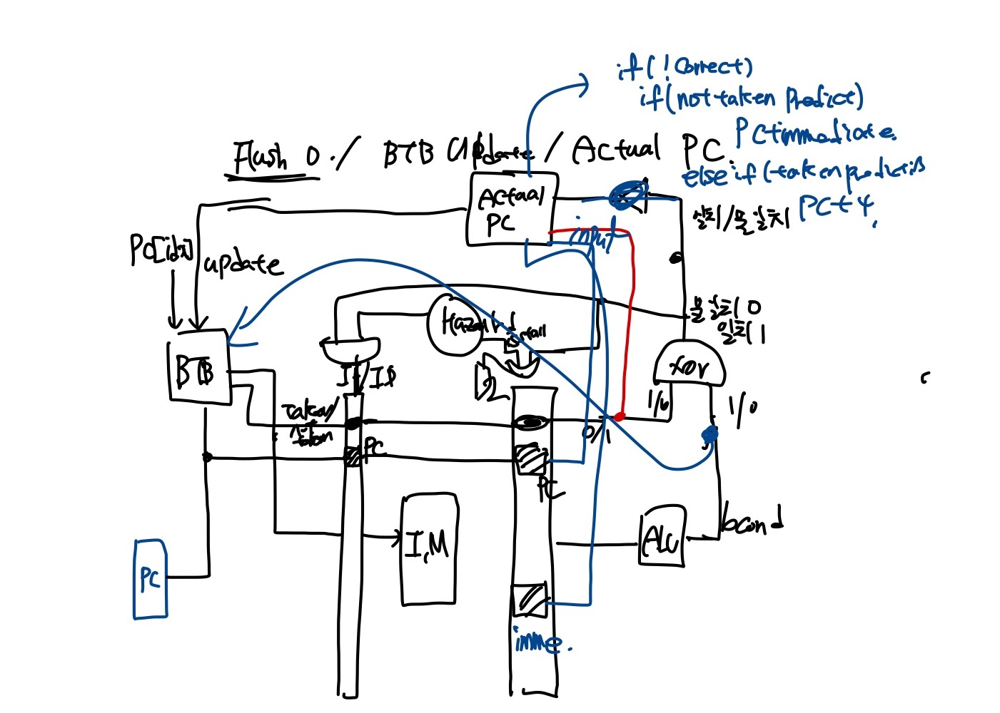

# 2022 Computer Architecture Lab 4.b
#### 20180085 컴퓨터공학과 송수민
## I. Introduction
    Lab 4.b에서는 4.a에 이어서 branch predictor를 구현한다. Branch Predictor는 여러가지 방법으로 구현 할 수 있는데, 본 과제에서는 always not taken, always taken, 2-bit saturation branch history predictor로 구현하고, 3번째 branch predictor를 중심으로 보고서를 작성한다. 이는 branch, jal의 instruction이 recent branch history를 근거로 
    jump를 하는 경향을 발견한 것에서 착안된 기법이다. 최근에 taken이었던 Branch는 다시 한번 taken일 확률이 높다는 것이다. 하지만 반대의 경우도 있기 때문에 4개의 state를 기반으로 branch prediction을 실시한다.
## II. Design
    Design은 이전 Lab 4.a에 몇가지의 모듈과 datapath를 추가한다. 대략적인 design은 아래 그림과 같다. BTB Module은 Branch Predictor module이며 BTB entry에 있는 값들을 기반으로 다음 pc를 예측한다. ActualPC는 EX단계에서 resolve되는 branch, jal, jalr들을 판별하여 실제로 이어지는 PC를 구한다. 

## III. Implementation
    다음은 구현 방법이다. 
    
- 1. PC <br>
 ```verilog    
module PC(input reset, input clk, input pc_write, input [`word_size-1:0] next_pc, output reg [`word_size - 1: 0] current_pc);
    always @(posedge clk) begin
        if(reset)
            current_pc <= `word_size'd0;
        else begin
            if(pc_write) 
                current_pc <= next_pc;   
        end
    end 
endmodule
```
> PC는 clock이 posedge일 때 synchronously update하도록 구현하였다. 모듈 구현 방법은 Single cycle CPU와 크게 다른점은 없으며, data dependency가 존재하여 stall이 필요할 때는 다음 pc로 update되면 안되기 때문에 pc_write가 1일 경우에만 update를 진행하는 방식으로 통제한다. Stall일 경우 pc_write는 0이다.
- 2. RegisterFile, Memory, Immediate
> RegisterFile,Memory는 제공된 것을 사용하였으므로 생략한다. ImmediateGenerator는 multi-cycle cpu와 같은 모듈을 사용하였다. 
- 3. ALU
```verilog
module ALU(input [3:0] alu_op, input [`word_size-1:0] alu_in_1,
input [`word_size-1:0] alu_in_2,output reg [`word_size-1:0] alu_result,output reg alu_bcond);
    always @(*) begin
        case(alu_op)
            `ALU_ADD : alu_result = alu_in_1 + alu_in_2;
            `ALU_SUB : alu_result = alu_in_1 - alu_in_2;
            `ALU_SLL: alu_result = alu_in_1 << alu_in_2[4:0];
            `ALU_XOR: alu_result = alu_in_1 ^ alu_in_2;
            `ALU_OR: alu_result = alu_in_1 | alu_in_2;
            `ALU_AND: alu_result = alu_in_1 & alu_in_2;
            `ALU_SRL: alu_result = alu_in_1 >> alu_in_2[4:0];
            `ALU_BEQ: begin
                alu_result = alu_in_1 - alu_in_2;
                if(alu_result == 0)
                    alu_bcond = 1;
                else
                    alu_bcond = 0;
            end
            `ALU_BNE: begin
                alu_result = alu_in_1 - alu_in_2;
                if(alu_result != 0)
                    alu_bcond = 1;
                else
                    alu_bcond = 0;
            end
            `ALU_BLT: begin
                alu_result = alu_in_1 - alu_in_2;
                if($signed(alu_result)<0)
                    alu_bcond = 1;
                else
                    alu_bcond = 0;
            end
            `ALU_BGE: begin
                alu_result = alu_in_1 - alu_in_2;
                if($signed(alu_result)>=0)
                    alu_bcond = 1;
                else
                    alu_bcond = 0;
            end
        endcase

    end
endmodule

module ALUControlUnit(input [6:0] part_of_inst, input [31:0] inst, output reg [3:0] alu_op);
    //inst[10] -> funct7 / inst[9:7] funct3 / inst[6:0] opcode
    always @(*) begin
        case(part_of_inst[6:0])
            `ARITHMETIC: begin 
                if(inst[30])
                    alu_op = `ALU_SUB;
                else begin
                    case(inst[14:12])
                        `FUNCT3_ADD: alu_op = `ALU_ADD;
                        `FUNCT3_SLL: alu_op = `ALU_SLL;
                        `FUNCT3_XOR: alu_op = `ALU_XOR;
                        `FUNCT3_OR: alu_op = `ALU_OR;
                        `FUNCT3_AND: alu_op = `ALU_AND;
                        `FUNCT3_SRL: alu_op = `ALU_SRL;
                    endcase
                end
            end
            `ARITHMETIC_IMM: begin
                case(inst[14:12]) 
                    `FUNCT3_ADD: alu_op = `ALU_ADD;
                    `FUNCT3_SLL: alu_op = `ALU_SLL;
                    `FUNCT3_XOR: alu_op = `ALU_XOR;
                    `FUNCT3_OR: alu_op = `ALU_OR;
                    `FUNCT3_AND: alu_op = `ALU_AND;
                    `FUNCT3_SRL: alu_op = `ALU_SRL;
                endcase
            end
            `LOAD: alu_op = `ALU_ADD;
            `STORE: alu_op = `ALU_ADD;
            `JALR: alu_op = `ALU_ADD;
            `JAL: alu_op = `ALU_ADD;
            `BRANCH: begin
                case(inst[14:12])
                    `FUNCT3_BEQ: alu_op = `ALU_BEQ;
                    `FUNCT3_BNE: alu_op = `ALU_BNE;
                    `FUNCT3_BLT: alu_op = `ALU_BLT;
                    `FUNCT3_BGE: alu_op = `ALU_BGE;
                endcase
            end
            `TEMP: alu_op = `ALU_ADD;  //ADDED
            `ECALL: alu_op = `ALU_BEQ; // ADDED
        endcase
    end
endmodule
```
> ALU.v에는 alu module과 alu control module을 함께 구현하였다. <br>
> Multi - cycle CPU와 같은 모듈을 사용하였다. 직전 Lab과 다르게 JAL, JALR, BRANCH관련 control bit가 사용된다.
- 4. ControlUnit
```verilog
module ControlUnit(input [6:0]part_of_inst, input isStall,input correct,input correct2, output reg mem_read, output reg mem_to_reg, 
output reg mem_write, output reg alu_src, output reg write_enable,output reg pc_to_reg, output reg [6:0]alu_op, output reg is_ecall,
 output reg is_branch, output reg is_jal, output reg is_jalr);
    always @(*) begin
      if(isStall) begin
        mem_read = 0; mem_to_reg = 0; mem_write = 0; write_enable = 0; alu_op = 7'b0110111; is_ecall = 0;
        pc_to_reg = 0; is_branch = 0; is_jal = 0; is_jalr = 0;
      end
      else begin
        mem_read = part_of_inst == `LOAD;
        mem_to_reg = part_of_inst == `LOAD;
        mem_write = part_of_inst == `STORE;
        alu_src = ((part_of_inst != `ARITHMETIC) && (part_of_inst != `BRANCH));
        write_enable = ((part_of_inst != `STORE) && (part_of_inst != `BRANCH) && (part_of_inst != `ECALL));
        pc_to_reg = (part_of_inst == `JAL || part_of_inst == `JALR);
        is_ecall = part_of_inst == `ECALL;
        is_branch = part_of_inst == `BRANCH;
        is_jal = part_of_inst == `JAL;
        is_jalr = part_of_inst == `JALR;
        case(part_of_inst[6:0])
          `ARITHMETIC: alu_op = `ARITHMETIC;
          `ARITHMETIC_IMM : alu_op = `ARITHMETIC_IMM;
          `LOAD : alu_op = `LOAD;
          `STORE : alu_op = `STORE;
          `BRANCH : alu_op = `BRANCH;
          `JAL: alu_op = `JAL;
          `JALR : alu_op = `JALR;
        //`ECALL: alu_op = `ECALL;
        endcase
      end
    end
endmodule
```
> Control module은 다시 single cycle cpu때 사용하던 모듈을 사용하였다. ALU와 마찬가지로 PC control에 영향을 끼치는 Instruction에 관한 control bit들이 추가되었다. pc_to_reg는 jal, jalr을 위해, is_branch, is_jal, is_jalr 또한 추가하여 현 instruction이 무엇인지 판별한다.
- 5. HazardDetection
```verilog
module HazardDetection(input [6:0]opcode, input [31:0]inst, input [31:0]clk, input [4:0]ID_EX_rd, input ID_EX_mem_read,
output reg isStall, output reg IF_ID_write, output reg pc_write);
    reg use_rs1; 
    reg use_rs2; // caution!
    reg [1:0]clk_start;
    always @(*) begin
        if(opcode !=`JAL && inst[19:15]!=0)
            use_rs1 = 1;
        else
            use_rs1 = 0;
        if(opcode != `JAL && opcode != `ARITHMETIC_IMM && opcode != `JALR && opcode != `LOAD && inst[24:20]!=0)
            use_rs2 = 1;
        else
            use_rs2 = 0;
        if((((inst[19:15] == ID_EX_rd) && use_rs1) || ((inst[24:20] == ID_EX_rd) && use_rs2)) && ID_EX_mem_read) begin
            isStall = 1;
            IF_ID_write = 0; 
            pc_write = 0;
            //clk_start = clk;
        end
        else begin
            isStall = 0;
            IF_ID_write = 1; 
            pc_write = 1;
        end
    end
endmodule
```
> Hazard Detection은 직전 Lab에서 jal, branch, jalr을 모두 고려하여 작성하였기 때문에 변경사항이 없다. 
- 6. Forwarding
```verilog
module Forwarding(input [4:0]ID_EX_rs1_num, input [4:0]ID_EX_rs2_num, input [4:0] EX_MEM_rd, input [4:0] MEM_WB_rd, 
input EX_MEM_reg_write, input MEM_WB_reg_write, output reg [1:0]Forward_A, output reg [1:0]Forward_B);
    always @(*) begin
        if(ID_EX_rs1_num!=0 && (ID_EX_rs1_num == EX_MEM_rd) && EX_MEM_reg_write)
            Forward_A = 2'b10;
        else if((ID_EX_rs1_num!=0) && (ID_EX_rs1_num == MEM_WB_rd) && MEM_WB_reg_write)
            Forward_A = 2'b01;
        else
            Forward_A = 0;
        if(ID_EX_rs2_num!=0 && (ID_EX_rs2_num == EX_MEM_rd) && EX_MEM_reg_write)
            Forward_B = 2'b10;
        else if((ID_EX_rs2_num!=0) && (ID_EX_rs2_num == MEM_WB_rd) && MEM_WB_reg_write)
            Forward_B = 2'b01;
        else
            Forward_B = 0;
    end
endmodule

module InternalForwarding(input [4:0]rs1, input [4:0]rs2, input [4:0] MEM_WB_rd,input MEM_WB_reg_write,
 output reg inter_forward_A, output reg inter_forward_B);
    always @(*) begin
        if((rs1!=0)&& (rs1 == MEM_WB_rd) && MEM_WB_reg_write ) // caution! add / / / sw case 
            inter_forward_A = 1;
        else
            inter_forward_A = 0;
        if((rs2!=0)&& (rs2 == MEM_WB_rd) && MEM_WB_reg_write )
            inter_forward_B = 1;
        else
            inter_forward_B = 0;
    end
endmodule
```
> Forwarding & Internal Forwarding 또한 직전 Lab에서 jal, branch, jalr을 모두 고려하여 작성하였기 때문에 변경사항이 없다. 
- 7. BranchPredictor
```verilog
module BP(input reset, input clk, input [31:0]PC, input [4:0]target_idx, input [24:0]target_tag,input [31:0]actual_PC, input isBJ, input isBranch,
input correct, input correct2, input [31:0]ID_EX_pred_pc,
 output reg [31:0] predict_PC, output reg istaken); // isBJ -> branch or JAL
    reg [57:0]BTB[0:31]; // 59 valid bit / tag = (58,34) / taken (33,32) / pc (31,0)
    reg [1:0]counter;
    integer i;
    always @(*) begin
            if((PC[31:7] == BTB[PC[6:2]][56:32]) && (counter == 2'b10 || counter == 2'b11)&&(BTB[PC[6:2]][57] == 1)) begin
                predict_PC = BTB[PC[6:2]][31:0];
                istaken = 1;
            end
            else begin
                predict_PC = PC + 4;
                istaken = 0;
            end

    end
    always @(posedge clk) begin
        if(reset) begin
            counter <= 0;
            for(i = 0 ; i<32 ;i = i+1)
                BTB[i][57:0] <= 0;
        end
        else begin
            if(isBJ)begin
                BTB[target_idx][57] <= 1; // valid bit
                BTB[target_idx][56:32] <= target_tag;
                if(!correct || !correct2)
                    BTB[target_idx][31:0] <= actual_PC;
                else
                    BTB[target_idx][31:0] <= ID_EX_pred_pc;
                    case(counter)
                        2'b00: begin
                            if(correct) counter <= 2'b00;
                            else counter <= 2'b01;
                        end
                        2'b01: begin
                            if(correct) counter <= 2'b00;
                            else counter <= 2'b10;
                        end
                        2'b10: begin
                            if(correct) counter <= 2'b11;
                            else counter <= 2'b01;
                        end
                        2'b11: begin
                            if(correct) counter <= 2'b11;
                            else counter <= 2'b10;
                        end
                    endcase
            end
        end
    end
endmodule
```
> 이번 Lab의 핵심이다. 각 BTB entry의 초기화, 변경은 posedge clk에 의해 synchronization하게 update된다. reset이 true인 경우 BTB entry값들을 모두 0으로 초기화 시킨다. BTB entry는 총 58bit이면 다음과 같이 구성하였다.<br>
- 58bit = Valid(1bit) + Tag(25bit) + TargetPC(32bit) <br>
> Branch / Jump instruction일 때만 update하도록 하였다. isBJ는 ID/EX pipeline register에서 오는 is_jal || is_jalr || is_branch이다. Update된다는 것은 BTB entry가 활성화 된다는 뜻으로 valid bit에 1을 넣어주고, Tag까지는 Default로 update한다. 단, PC value에 대해서는 예측이 틀렸을 때만 update하도록 작성하였다. Correct, Correct2의 변수 2개로 판별하는데, Correct는 Taken/NotTaken 예측부터 틀렸을 때, Correct2는 Taken/NotTaken 예측은 맞았으나, Jump 해야하는 TargetPC가 틀렸을 때이다. 이 두가지의 경우에는 targetPC까지 update한다. 이외의 상황에는 예측한 PC를 계속 넣어준다. Saturation prediction counter는 이전 값을 기반으로 update한다. 예측이 맞았다면 그 예측을 강화하는 쪽으로, 예측이 틀렸다면 해당 예측을 약화시키는 방향으로 값을 설정한다.
- 8. ActualPC
```verilog
module ActualPC(input correct, input correct2,input isJAL, input isBranch, input isJALR, input [31:0] PC, input[31:0] immediate, 
input [31:0] alu_result, input alu_bcond, output reg[31:0] actualPC);
    always @(*) begin
    if(!correct) begin
        if(isJAL || isJALR)
            actualPC = alu_result;
        else if(isBranch) begin
            if(alu_bcond)
                actualPC = PC + immediate;
            else
                actualPC = PC + 4;
        end
end
    if(!correct2) begin
        if(isJAL || isJALR)
            actualPC = alu_result;
        else if(isBranch) begin
            if(alu_bcond)
                actualPC = PC + immediate;
            else
                actualPC = PC + 4;
        end
    end
    end
endmodule
```
> ActualPC에서는 예측이 틀렸을 경우 next_pc값을 교정하기 위해 실제 진행되어야 하는 pc를 계산한다. JAL/JALR의 경우 항상 taken이기 때문에 ALU에서 항상 계산을 한다. 따라서, 해당 instruction의 예측이 틀렸을 경우는 올바른 pc는 반드시 alu_result이다. Branch의 경우 조금 다르다. Branch의 경우 ALU의 계산에서 비교 연산을 하기 때문에 주소 연산을 따로 처리해주어야 한다. 
> 두가지 케이스가 있다. NotTaken으로 예측하였는데 실제로 alu_bcond는 1이 나와 Taken인 경우, Taken으로 예측하였는데 alu_bcond는 0이 나와 notTaken인 경우이다. 각각의 경우 전자는 PC+immediate, 후자의 경우 PC+4로 ActualPC를 output으로 내준다.
- 7. CPU
```verilog
 always @(posedge clk) begin
    if (reset || !correct || !correct2) begin
      IF_ID_inst <=0;
      IF_ID_pc <= 0;
      IF_ID_pred_pc <= 0;
      IF_ID_prediction <= 0;
      //total_cyc<=0;
    end
    always @(posedge clk) begin
    if (reset || !correct || !correct2) begin
      ID_EX_rs1_data <=0;
      ID_EX_rs2_data <=0;
      ID_EX_inst <= 0;
      ID_EX_rs1_num <= 0;
      ID_EX_rs2_num <= 0;
      ID_EX_rd <= 0;
      ID_EX_imm <= 0;
      ////////////
      ID_EX_mem_read <= 0;
      ID_EX_mem_to_reg <= 0;
      ID_EX_mem_write <= 0;
      ID_EX_alu_src <= 0;
      ID_EX_reg_write <= 0;
      ID_EX_pc_to_reg <= 0;
      ID_EX_alu_op <= 0;
      ID_EX_pc_to_reg <= 0;
      ID_EX_is_branch <= 0;
      ID_EX_is_jal <=0;
      ID_EX_is_jalr <= 0;
      ID_EX_pc <= 0;
      ID_EX_pred_pc <=0;
      ID_EX_prediction <=0;
    end
...
 if(Forward_A == 2'b00)
      alu_in_1_temp = ID_EX_rs1_data;
    else if(Forward_A == 2'b01)
      alu_in_1_temp = final_data;
    else if(Forward_A == 2'b10)
      alu_in_1_temp = EX_MEM_alu_out;
    if(ID_EX_is_jal)
      alu_in_1 = ID_EX_pc;
    else
      alu_in_1 = alu_in_1_temp;
    if(Forward_B == 2'b00)
      alu_temp= ID_EX_rs2_data;
    else if(Forward_B == 2'b01)
      alu_temp = final_data;
    else if(Forward_B == 2'b10)
      alu_temp = EX_MEM_alu_out;
    if(ID_EX_alu_src)
      alu_in_2 = ID_EX_imm;
    else
      alu_in_2 = alu_temp;
    if(ID_EX_is_branch || ID_EX_is_jal || ID_EX_is_jalr)
      isBJ = 1;
    else
      isBJ = 0;
    if((ID_EX_is_branch &&(alu_bcond && !ID_EX_prediction)) || (ID_EX_is_branch &&(!alu_bcond && ID_EX_prediction)) || (ID_EX_is_jal && !ID_EX_prediction) || (ID_EX_is_jalr && !ID_EX_prediction))
      correct = 0; // 그냥 예측이 틀렸을 때
    else
      correct = 1;
    if((ID_EX_is_branch &&(alu_bcond && ID_EX_prediction) && ID_EX_pred_pc!= ID_EX_pc + ID_EX_imm)||(ID_EX_is_branch &&(!alu_bcond && !ID_EX_prediction) && ID_EX_pred_pc!= ID_EX_pc + 4) || (ID_EX_is_jal && ID_EX_prediction && ID_EX_pred_pc!= ID_EX_pc + ID_EX_imm) || 
    (ID_EX_is_jalr && ID_EX_prediction && ID_EX_pred_pc!= alu_result)) // 예측은 맞았지만 predict PC가 틀렸을 때
      correct2 = 0;
    else
      correct2 = 1;
    if(MEM_WB_mem_to_reg)
      final_data = MEM_WB_mem_to_reg_src_1;
    else
      final_data = MEM_WB_mem_to_reg_src_2;
    if(MEM_WB_pc_to_reg)
      final_data = MEM_WB_pc + 4;
    if(!correct || !correct2)
      next_pc = actual_pc;
    else
      next_pc = pred_pc;
  end
```
> CPU module은 직전 Lab과 동일하게 전체적인 flow를 통제 및 하위 모듈에서 통제에 필요한 control bit를 생성하는데 사용하였다. 먼저 상단 부분의 always부분은 flush를 처리하는 것이다. 예측이 틀렸을 경우 IF->ID / ID->EX로 넘어가는 instruction은 모두 무효화해주어야 한다. 따라서, 기존의 초기화 구문을 활용하여 조건을 추가함으로써 구현할 수 있다. 어차피 control bit를 0으로 만들어 PVS를 건들지 못하게 하는 것이 구현 방법이기 때문에, 모든 register를 초기화해도 무방하다. 아래 Flow처리에서는 ALU에 들어가는 input_1이 PC인 경우가 추가 되었으므로 이를 고려하여 temp값을 하나 만들어 mux를 구현한다. BranchPredictor에서 쓰이는 isBJ를 cpu module에서 만든다. 위에서 언급하였던 branch prediction이 틀린 두 가지 케이스에 대해 처리를 해주고, 이제 JAL/JALR은 register에 PC+4값을 넣기 때문에 이를 고려하여 처리한다. 예측이 틀린 경우 next_pc를 actualPC output으로 주고, 예측이 맞았다면 pred_pc를 계속해서 넣어준다. 
## 4. Discussion
1. Memory Declaration
> 이번 Lab이 실질적으로 verilog에서 memory를 구현해서 사용하는 것이 처음인 Lab이었다. 거꾸로 선언을 하여 모든 cycle값이 notTaken과 같게나왔다. BTB가 제 역할을 하지 못해 모두 notTaken 처리한 것 같다. 문법의 중요성을 다시 알게되었다.<br>
2. Maintain previous prediction data 
> 초기에 2-bit Branch history prediction을 구현할 때는 taken으로 예측했는지, notTaken으로 예측했는지만의 정보를 가지고 가면 모든 케이스를 처리할 수 있을 것이라 생각했다. 하지만, 예측은 맞아도 TargetPC가 다른 경우가 존재하였고 이를 처리하기 위해서 현재의 PC와 예측한 PC모두 Pipeline register로 가지고 가게 되었다. 이와 같이 구현 할때, register의 수가 늘어나므로 cost가 늘어날 것을 
> 고려하여 다른 방법을 생각해보고자 하였으나, 별다른 아이디어를 떠올리지 못하였다. PC value는 가지고 가야될 것 같다. 
3. Using different stage's control bit
> 직전 Lab과 마찬가지로 각 stage에 맞는 pipeline register를 사용하는 것이 중요하였다. 또한, 하위 모듈에 값을 전달할 때도 적합한 stage의 값, 최신화 된 값을 전달하는 것에 신경을 써야했다. 이는 그래도 디버깅으로 쉽게 잡을 수 있어 해결이 용이하였다. 
4. 'Global' 2-bit Branch Predictor
> Global의 의미를 잘못 파악하여 32개 entry마다 Branch history table을 만들어 구현하였었다. 잘못 된 점을 알고 Counter register를 선언하여 이를 기준으로 taken / notTaken을 판단하게 하였다. 기존에 하였던 구현법도 아래에 첨부하여 비교하였다.
```verilog
module BP(input reset, input clk, input [31:0]PC, input [4:0]target_idx, input [24:0]target_tag,input [31:0]actual_PC, input isBJ, input correct, input correct2, input [31:0]ID_EX_pred_pc,
 output reg [31:0] predict_PC, output reg istaken); // isBJ -> branch or JAL
    reg [59:0]BTB[0:31]; // 59 valid bit / tag = (58,34) / taken (33,32) / pc (31,0)
    //integer i;
    always @(*) begin
            if((PC[31:7] == BTB[PC[6:2]][58:34]) && (BTB[PC[6:2]][33:32] == 2'b10 || BTB[PC[6:2]][33:32] == 2'b11)&&(BTB[PC[6:2]][59] == 1)) begin
                predict_PC = BTB[PC[6:2]][31:0];
                istaken = 1;
            end
            else begin
                predict_PC = PC + 4;
                istaken = 0;
            end

    end
    always @(posedge clk) begin
        if(reset) begin
        ... initialization ...
        end
        else begin
            if(isBJ)begin
                BTB[target_idx][59] <= 1; // valid bit
                BTB[target_idx][58:34] <= target_tag;
                if(!correct || !correct2)
                    BTB[target_idx][31:0] <= actual_PC;
                else
                    BTB[target_idx][31:0] <= ID_EX_pred_pc;
                case(BTB[target_idx][33:32])
                    2'b00: begin
                        if(correct) BTB[target_idx][33:32] <= 2'b00;
                        else BTB[target_idx][33:32] <= 2'b01;
                    end
                    2'b01: begin
                        if(correct) BTB[target_idx][33:32] <= 2'b00;
                        else BTB[target_idx][33:32] <= 2'b10;
                    end
                    2'b10: begin
                        if(correct) BTB[target_idx][33:32] <= 2'b11;
                        else BTB[target_idx][33:32] <= 2'b01;
                    end
                    2'b11: begin
                        if(correct) BTB[target_idx][33:32] <= 2'b11;
                        else BTB[target_idx][33:32] <= 2'b10;
                    end
                endcase
            end
        end
    end
endmodule
```
## 5. Conclusion
    이번 과제를 통해 3가지 방법으로 branch predictor를 구현해보았다. 아래는 각 testcase에 따른 cycle 수이다.
||Non-control-flow|If-else|Recursive|
|------|---|---|----|
|NotTaken|56 cycles|42 cycles|1186 cycles|
|Taken|56 cycles|50 cycles|1204 cycles|
|Global 2-bit|56 cycles|42 cycles|1062 cycles|
|BHT 32entry 2-bit|56 cycles|42 cycles|1050 cycles|
<br>
    전체적인 경향으로 보았을 때, Taken의 control flow cycle 수가 가장 많고, NotTaken, Global 2-bit prediction, BHT 32 entry 2-bit 순으로 나타났다. 이는 recursive code를 보면 fibo에서 계속해서 branch로 값을 비교하는 과정이 있었는데, always taken을 하면 비교 값에 상관없이 항상 jump하여 이 부분에서 손해를 본 것 같다. 2 -bit는 가장 cycle 수가 적어 두 branch predictor보다 좀 더 발전된 모습을 보임에 성공하였다. 또한, 마지막 두개의 Cycle수를 보면 PC마다 branch history를 관리해주면 조금이나마 더 나은 결과를 보이는 것을 확인 할 수 있었다.

