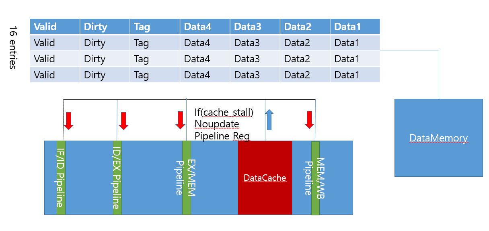

# 2022 Computer Architecture Lab 5
#### 20180085 컴퓨터공학과 송수민
## I. Introduction
    Lab 5에서는 기존에 사용하던 Magic memory를 대체하여 Data Cache를 구현한다. Magic memory는 요청받은 값을 읽어서 내보내거나, 쓸 때 1cycle만에 처리가 되었지만, 이것은 'magic'이라는 말과 같다. CPU에서 memory 사이에서 data를 옮겨 받는 latency는 길기 때문에, 이 사이에 자주쓰이는, 쓰일 것 같은 
    data를 적재하여 필요할 때 쓰는 Cache를 구현한다. 본 과제에서는 Direct Mapped Cache를 구현할 것이며, block offset은 4로 Cache 1개의 line에 4개의 data가 들어간다.
## II. Design
    아래와 같이 Direct Mapped Cache를 구현하였다. Input으로 들어가는 값이 32Bit인데, 2bit를 block size를 나타는데 쓰이고, 2bit를 block offset를 나타내고, 16개의 entry를 indexing해야하므로 4개의 bit가 idx로 쓰인다. 따라서, tag로 쓰이는 bits는 32-2-2-4 = 24bit이다. 즉, cache 1개의 line은 valid bit (1) + dirty bit (1) + tag bit (24bit) + data bit (32*4 = 128bit) = 154bit이다. 추가로, 이번 lab에서 datamemory에서 data를 읽거나 쓰는 latency는 50cycle이므로, 이 시간 동안은 WB이전까지의 instruction은 모두 멈춰야 한다. 이를 implementation에서 설명한다.

## III. Implementation
    다음은 구현 방법이다. 
    
- 1. PC <br>
 ```verilog    
module PC(input reset, input clk, input pc_write, input [`word_size-1:0] next_pc, output reg [`word_size - 1: 0] current_pc);
    always @(posedge clk) begin
        if(reset)
            current_pc <= `word_size'd0;
        else begin
            if(pc_write) 
                current_pc <= next_pc;   
        end
    end 
endmodule
```
> PC는 이전 Lab의 구현과 동일하다. 초기에는 PC module에 cache_stall를 input으로 넣어 !cache_stall인 경우를 &&로 추가하려 하였지만, cpu에서 충분히 처리할 수 있어 새로운 input을 넣지 않았다.
- 2. RegisterFile,Immediate,InstMemory
> RegisterFile,InstMemory는 제공된 것을 사용하였으므로 생략한다. ImmediateGenerator는 multi-cycle cpu와 같은 모듈을 사용하였다. Datamemory 또한 제공된 것을 사용하였지만 설명이 필요하여 뒤에 후술한다. 
- 3. ALU
```verilog
module ALU(input [3:0] alu_op, input [`word_size-1:0] alu_in_1,
input [`word_size-1:0] alu_in_2,output reg [`word_size-1:0] alu_result,output reg alu_bcond);
    always @(*) begin
        case(alu_op)
            `ALU_ADD : alu_result = alu_in_1 + alu_in_2;
            `ALU_SUB : alu_result = alu_in_1 - alu_in_2;
            `ALU_SLL: alu_result = alu_in_1 << alu_in_2[4:0]; // NEW!
            `ALU_SLLR: alu_result = alu_in_1 << alu_in_2;
            `ALU_XOR: alu_result = alu_in_1 ^ alu_in_2;
            `ALU_OR: alu_result = alu_in_1 | alu_in_2;
            `ALU_AND: alu_result = alu_in_1 & alu_in_2;
            `ALU_SRL: alu_result = alu_in_1 >> alu_in_2[4:0]; // NEW!
            `ALU_SRLR: alu_result = alu_in_1 >> alu_in_2;
            `ALU_BEQ: begin
                alu_result = alu_in_1 - alu_in_2;
                if(alu_result == 0)
                    alu_bcond = 1;
                else
                    alu_bcond = 0;
            end
            `ALU_BNE: begin
                alu_result = alu_in_1 - alu_in_2;
                if(alu_result != 0)
                    alu_bcond = 1;
                else
                    alu_bcond = 0;
            end
            `ALU_BLT: begin
                alu_result = alu_in_1 - alu_in_2;
                if($signed(alu_result)<0)
                    alu_bcond = 1;
                else
                    alu_bcond = 0;
            end
            `ALU_BGE: begin
                alu_result = alu_in_1 - alu_in_2;
                if($signed(alu_result)>=0)
                    alu_bcond = 1;
                else
                    alu_bcond = 0;
            end
        endcase

    end
endmodule

module ALUControlUnit(input [6:0] part_of_inst, input [31:0] inst, output reg [3:0] alu_op);
    //inst[10] -> funct7 / inst[9:7] funct3 / inst[6:0] opcode
    always @(*) begin
        case(part_of_inst[6:0])
            `ARITHMETIC: begin 
                if(inst[30])
                    alu_op = `ALU_SUB;
                else begin
                    case(inst[14:12])
                        `FUNCT3_ADD: alu_op = `ALU_ADD;
                        `FUNCT3_SLL: alu_op = `ALU_SLLR; // NEW!
                        `FUNCT3_XOR: alu_op = `ALU_XOR;
                        `FUNCT3_OR: alu_op = `ALU_OR;
                        `FUNCT3_AND: alu_op = `ALU_AND;
                        `FUNCT3_SRL: alu_op = `ALU_SRLR; // NEW!
                    endcase
                end
            end
            `ARITHMETIC_IMM: begin
                case(inst[14:12]) 
                    `FUNCT3_ADD: alu_op = `ALU_ADD;
                    `FUNCT3_SLL: alu_op = `ALU_SLL;
                    `FUNCT3_XOR: alu_op = `ALU_XOR;
                    `FUNCT3_OR: alu_op = `ALU_OR;
                    `FUNCT3_AND: alu_op = `ALU_AND;
                    `FUNCT3_SRL: alu_op = `ALU_SRL;
                endcase
            end
            `LOAD: alu_op = `ALU_ADD;
            `STORE: alu_op = `ALU_ADD;
            `JALR: alu_op = `ALU_ADD;
            `JAL: alu_op = `ALU_ADD;
            `BRANCH: begin
                case(inst[14:12])
                    `FUNCT3_BEQ: alu_op = `ALU_BEQ;
                    `FUNCT3_BNE: alu_op = `ALU_BNE;
                    `FUNCT3_BLT: alu_op = `ALU_BLT;
                    `FUNCT3_BGE: alu_op = `ALU_BGE;
                endcase
            end
            `TEMP: alu_op = `ALU_ADD;  
            `ECALL: alu_op = `ALU_BEQ; 
        endcase
    end
endmodule
```
> 4.1 lab 채점 결과 잘못된 점을 발견하여 수정하였다. Shift instruction의 경우 R-type과 I-type의 경우 alu_in_2의 값이 다른데, 이를 파악하지 못하고 같게 처리하였다. R-type인 경우 alu_in_2의 32bit 전체를 계산에 사용하도록 구현하였다.
- 4. ControlUnit
```verilog
module ControlUnit(input [6:0]part_of_inst, input isStall,input correct,input correct2, output reg mem_read, output reg mem_to_reg, 
output reg mem_write, output reg alu_src, output reg write_enable,output reg pc_to_reg, output reg [6:0]alu_op, output reg is_ecall,
 output reg is_branch, output reg is_jal, output reg is_jalr);
    always @(*) begin
      if(isStall) begin
        mem_write = 0; write_enable = 0; 
        mem_to_reg = 0; // Modified Here
      end
      else begin
        mem_read = part_of_inst == `LOAD;
        mem_to_reg = part_of_inst == `LOAD;
        mem_write = part_of_inst == `STORE;
        alu_src = ((part_of_inst != `ARITHMETIC) && (part_of_inst != `BRANCH));
        write_enable = ((part_of_inst != `STORE) && (part_of_inst != `BRANCH) && (part_of_inst != `ECALL));
        pc_to_reg = (part_of_inst == `JAL || part_of_inst == `JALR);
        is_ecall = part_of_inst == `ECALL;
        is_branch = part_of_inst == `BRANCH;
        is_jal = part_of_inst == `JAL;
        is_jalr = part_of_inst == `JALR;
        case(part_of_inst[6:0])
          `ARITHMETIC: alu_op = `ARITHMETIC;
          `ARITHMETIC_IMM : alu_op = `ARITHMETIC_IMM;
          `LOAD : alu_op = `LOAD;
          `STORE : alu_op = `STORE;
          `BRANCH : alu_op = `BRANCH;
          `JAL: alu_op = `JAL;
          `JALR : alu_op = `JALR;
        //`ECALL: alu_op = `ECALL;
        endcase
      end
    end
endmodule
```
> Cache stall이 일어나고 나서 load stall이 바로 발생하는 경우 control bit와 pipeline register의 값들이 잘못 넘겨지는 경우가 발생하였다. 이를 교정하기 위해, load stall이 발생한 경우 PVS에 영향을 줄 수 있는 control bit만을 0으로 초기화 하는 것으로 변경하였다.
- 5. HazardDetection
```verilog
module HazardDetection(input [6:0]opcode, input [31:0]inst, input [31:0]clk, input [4:0]ID_EX_rd, input ID_EX_mem_read,
output reg isStall, output reg IF_ID_write, output reg pc_write);
    reg use_rs1; 
    reg use_rs2; // caution!
    reg [1:0]clk_start;
    always @(*) begin
        if(opcode !=`JAL && inst[19:15]!=0)
            use_rs1 = 1;
        else
            use_rs1 = 0;
        if(opcode != `JAL && opcode != `ARITHMETIC_IMM && opcode != `JALR && opcode != `LOAD && inst[24:20]!=0)
            use_rs2 = 1;
        else
            use_rs2 = 0;
        if((((inst[19:15] == ID_EX_rd) && use_rs1) || ((inst[24:20] == ID_EX_rd) && use_rs2)) && ID_EX_mem_read) begin
            isStall = 1;
            IF_ID_write = 0; 
            pc_write = 0;
            //clk_start = clk;
        end
        else begin
            isStall = 0;
            IF_ID_write = 1; 
            pc_write = 1;
        end
    end
endmodule
```
> Hazard Detection은 변경사항이 없다.
- 6. Forwarding
```verilog
module Forwarding(input [4:0]ID_EX_rs1_num, input [4:0]ID_EX_rs2_num, input [4:0] EX_MEM_rd, input [4:0] MEM_WB_rd, 
input EX_MEM_reg_write, input MEM_WB_reg_write, output reg [1:0]Forward_A, output reg [1:0]Forward_B);
    always @(*) begin
        if(ID_EX_rs1_num!=0 && (ID_EX_rs1_num == EX_MEM_rd) && EX_MEM_reg_write)
            Forward_A = 2'b10;
        else if((ID_EX_rs1_num!=0) && (ID_EX_rs1_num == MEM_WB_rd) && MEM_WB_reg_write)
            Forward_A = 2'b01;
        else
            Forward_A = 0;
        if(ID_EX_rs2_num!=0 && (ID_EX_rs2_num == EX_MEM_rd) && EX_MEM_reg_write)
            Forward_B = 2'b10;
        else if((ID_EX_rs2_num!=0) && (ID_EX_rs2_num == MEM_WB_rd) && MEM_WB_reg_write)
            Forward_B = 2'b01;
        else
            Forward_B = 0;
    end
endmodule

module InternalForwarding(input [4:0]rs1, input [4:0]rs2, input [4:0] MEM_WB_rd,input MEM_WB_reg_write,
 output reg inter_forward_A, output reg inter_forward_B);
    always @(*) begin
        if((rs1!=0)&& (rs1 == MEM_WB_rd) && MEM_WB_reg_write ) // caution! add / / / sw case 
            inter_forward_A = 1;
        else
            inter_forward_A = 0;
        if((rs2!=0)&& (rs2 == MEM_WB_rd) && MEM_WB_reg_write )
            inter_forward_B = 1;
        else
            inter_forward_B = 0;
    end
endmodule
```
> Forwarding & Internal Forwarding은 변경사항이 없다. 단, module의 변화는 없지만, forwarding 처리에는 약간의 변화가 생기었다. Cache_stall에는 이를 막는다는 것인데, 이는 cpu.v에서 처리한다.
- 7. DataMemory
```verilog
reg [BLOCK_SIZE * 8 - 1:0] mem[0: MEM_DEPTH - 1];

  // delay counter used to delay the memory accesses
  reg [31:0] delay_counter;

  // Used to store the status of the previous memory request
  reg [31:0] _mem_addr;
  reg _mem_read;
  reg _mem_write;
  reg [BLOCK_SIZE * 8 - 1:0] _din;

  wire request_arrived;

  assign request_arrived = ((mem_read | mem_write) && is_input_valid);

  assign dout = (_mem_read && (delay_counter == 0)) ? mem[_mem_addr] : 0;
  assign is_output_valid = (_mem_read && delay_counter == 0);

  // Do not have to check `_mem_read == 0 & _mem_write == 0`
  assign mem_ready = delay_counter == 0;

  always @(posedge clk) begin
    // Initialize data memory
    if (reset) begin
       for (i = 0; i < MEM_DEPTH; i = i + 1)
         mem[i] = 0;
    end
    // Write data to the memory
    else if (_mem_write && delay_counter == 0) begin
      mem[_mem_addr] <= _din;
    end
  end

  always @(posedge clk) begin
    if (reset) begin
      delay_counter <= 0;
      _mem_read <= 0;
      _mem_write <= 0;
      _mem_addr <= 0;
      _din <= 0;
    end
    else if (request_arrived && delay_counter == 0) begin
      delay_counter <= DELAY;
      _mem_read <= mem_read;
      _mem_write <= mem_write;
      _mem_addr <= addr;
      _din <= din;
    end
    else if (delay_counter > 0) begin
      delay_counter <= delay_counter - 1;
    end
    else begin
      delay_counter <= 0;
      _mem_read <= 0;
      _mem_write <= 0;
      _mem_addr <= 0;
      _din <= 0;
    end
  end
endmodule
```
> DataMemory module을 이해하는 것이 중요하다. request_arrived는 memory에서 읽거나, 쓰여지는 op이 필요한 경우만 1로 on된다. 즉, cache에서 hit이 발생하여 memory까지 내려올 필요가 없는 경우에도 이 값이 1이되면 불필요한 cycle이 돌 것이기 때문에 이를 막기 위해서 cache에서 적절히 처리해주어야 한다. dout은 cache에서 memory로 부터 값을 가져와야 할 때, 즉 miss가 났을 때 경우를 나타낸다. is_output_valid는 cache miss이어서 값을 memory에서 가져와야 할 때, memory가 data를 준비 완료 하였다면 그 때 1로 on되는 것이다. 이외의 경우에는 memory에서 나가는 값은 valid하지 않다. mem_ready는 memory가 사용중인지를 나타내는 것이다. 이번 datamemory의 형식은 cache block의 하나하나의 값이 개별적으로 들어가는 것이 아니라, 한 line에 있는 값이 memory 한 index에 모두 들어간다. 따라서, cache에서 memory로 data를 보내 write-back을 할 때, 주소를 4bit를 밀어서 tag와 index bit로만 memory indexing을 해주어야한다. 이를 이해하면 cache를 구현할 수 있다.
- 8. Cache
```verilog
DataMemory #(.BLOCK_SIZE(LINE_SIZE)) data_mem(
    .reset(reset),
    .clk(clk),
    .is_input_valid(DataMemvalid),
    .addr({DataMemaddr>>4}),
    .mem_read(DataMemread),
    .mem_write(DataMemwrite),
    .din(DataMemdata),
    // is output from the data memory valid?
    .is_output_valid(dmem_output_valid),
    .dout(FromDataMem),
    // is data memory ready to accept request?
    .mem_ready(is_data_mem_ready)
  );
  
  assign is_ready = is_data_mem_ready;
  assign tag_match = DCache[addr[7:4]][151:128] == addr[31:8];
  assign isdirty = DCache[addr[7:4]][152] == 1;
  assign isvalid = DCache[addr[7:4]][153] == 1;
  always @(posedge clk) begin
    if(reset) begin
      for(i = 0 ; i<16 ; i= i+1) 
        DCache[i] <= 0;
        read_miss <=0;
        write_miss <=0;
        read_miss_state <= 0;
        write_miss_state <= 0;
        waitforWB <= 0;
        waitforWB_write <= 0;
        readhit <=0;
        writemisscomplete <=0;
        hit_count <= 0;
    end
    else if(is_input_valid) begin // Warning here
      ///read miss process
      if(read_miss && mem_read) begin
        if(read_miss_state == 0 && dmem_output_valid) begin //dataMemory?��?�� data�??��?��?�� �? ?���?
            DCache[addr[7:4]][151:128] <= addr[31:8];
            DCache[addr[7:4]][153] <= 1;
            DCache[addr[7:4]][152] <= 0;
            DCache[addr[7:4]][127:0] <= FromDataMem;
            if(isdirty) begin
              read_miss_state <= 3'b001;
              waitforWB <= 1;
            end
            else begin
              read_miss_state <= 0;
              waitforWB <= 0;
            end
        end
        else if(read_miss_state == 3'b001 && is_data_mem_ready) begin // dataMemory?��?�� write_back?���?
          waitforWB <= 0;
          read_miss_state <=0;
        end
      end
      /////////////////////////////////
      else if(!write_miss && mem_write) begin // write - hit
          DCache[addr[7:4]][152] = 1;
          case(addr[3:2])
          2'b00: begin
            DCache[addr[7:4]][31:0] <= din;
          end
          2'b01: begin
            DCache[addr[7:4]][63:32]<= din;
          end
          2'b10: begin
            DCache[addr[7:4]][95:64]<= din;
          end
          2'b11: begin
            DCache[addr[7:4]][127:96]<= din;
          end
          endcase
      end
      ///////////////////////////////////////
      else if(write_miss && mem_write) begin // write - miss
        if(write_miss_state == 0 && dmem_output_valid) begin
          DCache[addr[7:4]][151:128] <= addr[31:8];
          DCache[addr[7:4]][153] <= 1;
          DCache[addr[7:4]][152] <= 1;
          //DCache[addr[7:4]][127:0] <= FromDataMem;
          case(addr[3:2])
          2'b00: begin
            DCache[addr[7:4]][127:0] <= {FromDataMem[127:32],din};
          end
          2'b01: begin
            DCache[addr[7:4]][127:0]<= {FromDataMem[127:64],din,FromDataMem[31:0]};
          end
          2'b10: begin
            DCache[addr[7:4]][127:0]<= {FromDataMem[127:96],din,FromDataMem[63:0]};
          end
          2'b11: begin
            DCache[addr[7:4]][127:0]<= {din,FromDataMem[95:0]};
          end
          endcase
          if(isdirty) begin
            write_miss_state <= 3'b001;
            waitforWB_write <= 1;
          end
          else begin
            write_miss_state <= 3'b010;
            waitforWB_write <=0;
          end
        end
        else if(write_miss_state == 3'b001 && is_data_mem_ready) begin
          waitforWB_write <= 0;
          write_miss_state <= 3'b010;
        end
      end
    end
  end
  ///////////////////////////////////////////
  always @(*)begin
    if(tag_match && isvalid && mem_read && is_input_valid && !waitforWB)begin // read - hit + after read miss
      readhit = 1;
      DataMemread = 0;
      DataMemwrite = 0;
      DataMemvalid = 0;
      if(!read_miss)
        hit_count = hit_count + 1;
      read_miss = 0;
      case(addr[3:2]) 
        2'b00: begin
          dout = DCache[addr[7:4]][31:0];
        end
        2'b01: begin
          dout = DCache[addr[7:4]][63:32];
        end
        2'b10: begin
          dout = DCache[addr[7:4]][95:64];
        end
        2'b11: begin
          dout = DCache[addr[7:4]][127:96];
        end
      endcase
      is_hit = 1;
      is_output_valid = 1;
    end
    else if((!tag_match || !isvalid) && mem_read && is_input_valid || waitforWB) begin // read-miss
      read_miss = 1;
      DataMemvalid = is_data_mem_ready;
      if(is_data_mem_ready) begin
        if(isdirty && read_miss_state == 0) begin
          temp_read_miss_addr = {DCache[addr[7:4]][151:128],addr[7:4],4'b0000};
          temp_read_miss_data = DCache[addr[7:4]][127:0]; // for write_back
          DataMemaddr = addr;
          DataMemread = 1;
          DataMemwrite = 0;
          //DataMemvalid = 1;
        end
        else if(!isdirty && read_miss_state == 0) begin
          DataMemaddr = addr;
          DataMemread = 1;
          DataMemwrite = 0;
          //DataMemvalid = 1;
        end
        else if(read_miss_state == 3'b001) begin //write-back stage
          DataMemaddr = temp_read_miss_addr;
          DataMemdata = temp_read_miss_data;
          //DataMemvalid = 1;
          DataMemwrite = 1;
          DataMemread = 0;
        end
      end 
    is_hit = 0;
    is_output_valid = 0;
    end
    ////////////////////////////////////////////////////////////////////
    else if(write_miss_state == 3'b010) begin
      is_hit = 1;
      is_output_valid = 1;
      DataMemvalid = 0;
      write_miss = 0;
      write_miss_state = 0;
    end
    else if(tag_match && isvalid && mem_write && is_input_valid && !waitforWB_write) begin
      hit_count = hit_count + 1;
      write_miss = 0;
      DataMemvalid = 0;
      DataMemwrite = 0;
      DataMemread = 0;
      is_hit = 1;
      is_output_valid = 1;
    end
    else if((!tag_match || !isvalid) && mem_write && is_input_valid || waitforWB_write) begin
      write_miss = 1;
      DataMemvalid = is_data_mem_ready;
      if(is_data_mem_ready) begin
        if(isdirty && write_miss_state == 0) begin // datamemory?��?�� ?��?��?��?�� line �??��?���?
          temp_write_miss_addr = {DCache[addr[7:4]][151:128],addr[7:4],4'b0000};
          temp_write_miss_data = DCache[addr[7:4]][127:0];
          DataMemaddr = addr;
          DataMemread = 1;
          DataMemwrite = 0;
        end
        else if(!isdirty && write_miss_state == 0) begin
          DataMemaddr = addr;
          DataMemread = 1;
          DataMemwrite = 0;
        end
        else if(write_miss_state == 3'b001) begin
          DataMemaddr = temp_write_miss_addr;
          DataMemdata = temp_write_miss_data;
          DataMemread = 0;
          DataMemwrite = 1;
        end
      end
      is_hit = 0;
      is_output_valid = 0;
    end
  end
```
> 먼저 Datamemory port connection 부분에서 skeleton code에서는 CLOG2를 사용하는 듯 해보였지만, 이를 사용하니 계속 compile에서 오류가 생겨 4로 지정해주었다. 이는 CLOG2를 사용하여도 4가 나온다.  <br>
> 먼저 tag match, valid, dirty를 판별하기 위해 이를 assign 구문으로 추가하여 주었다. Tag match, valid, mem_read/write, is_input_valid로 hit/miss여부를 따진다.
> 1. Read Hit <br>
> Read hit인 경우에는 들어온 addr의 idx부분과 block offset을 이용하여 dout에 값을 넣어준다. 이때, datamemory가 작동되어 cycle이 돌지 않게 모든 datamemory control값을 off해준다. 또한, cpu에서 cache_stall을 처리하기 위해 is_hit, is_output_valid를 on시켜준다.
> 2. Read miss <br>
> Read miss인 경우 두 가지 경우로 나눌 수 있다. 그 line이 modified 되었는지 안되었는지로 나눌 수 있는데, dirty라면 이는 memory와 cache의 값이 서로 다르다는 것, 즉 memory의 값이 최신화가 안되어있다는 뜻이므로 write-back을 진행하여야 한다. 그런데, datamemory에서 읽고 가져오고 쓰는 것을 동시에 할 수 없어서 cache에 있는 값을 별도의 reg에 백업해두고, 먼저 memory에 있는 target data들을 가져와서 이를 cache에 작성한다. 그리고 백업 된 값을 memory에 보내 이를 write 하여 memory를 최신화 시킨다. 이때 주의할 점이, cache에 있는 값은 cpu가 원하는 값과 같아서 read hit이 날 것이므로 instruction들이 진행 될 것이다. 이를 막기 위해, writeback이 진행되고 있으면 이 정보를 담는 reg를 on시켜 read hit 구간에 들어가지 못하도록 통제한다. 결국 다음과 같은 process를 거치는 것이다. <br>
> Read-miss -> memory에서 target data 가져오기 -> 완료시 cache에 작성 후 작성 되면 writeback reg on -> writeback -> writeback끝나면 wrtieback reg off하여 read hit if문 진입하여 terminate. <br>
> 각각의 과정이 종료되었다는 것은 is_data_mem_ready, dmem_output_valid으로 알 수 있다. 전자는 writeback이 끝난 것으로, 후자는 memory에서 target data를 가져오는 것이 완료되었다는 뜻으로 사용할 수 있다. 1,2번 과정 중 cache에 쓰는 과정은 synchronously하게, 그 외는 asynchronously하게 구현하였다.
> 3. Write Hit <br>
> Write hit인 경우 해당 block에 din을 써준다. 이때, dirty bit를 1로 설정해준다. 이 과정은 posedge clk에 맞춰 synchronously하게 실시한다.
> 4. Write miss <br>
> 전체적인 과정은 Read miss와 동일하다. 값을 쓰는 것에 중점이 맞춰져 있고, dout을 내보내지 않는다는 것이 차이점이다. 하지만 주요한 차이점 하나가 있는데, write miss과정을 terminate 시킬 때, read miss는 read hit으로 가서 terminate시켰는데, write miss는 별도의 state를 만들어서 이 state에서 write miss, write miss state, is_hit, is_output_valid를 설정한다. 이는 read와 다르게 write는 값을 내보내지 않기 때문에 이 과정에서 문제가 발생하여서 따로 구성하였다.
- 9. CPU
```verilog
 else if(!cache_stall) begin
      //total_cyc <= total_cyc + 1;
      if(IF_ID_write) begin
        IF_ID_inst <= dout;
        IF_ID_PC <= current_pc;
      end
    end
    ..
else if(!cache_stall)begin
      if(inter_forward_A)
        ID_EX_rs1_data <= final_data;
      else
        ID_EX_rs1_data <= rs1_dout;
      if(inter_forward_B)
        ID_EX_rs2_data <= final_data;
      else
        ID_EX_rs2_data <= rs2_dout;
      ID_EX_inst <= IF_ID_inst;
      ID_EX_rs1_num <= IF_ID_inst[19:15];
      ID_EX_rs2_num <= IF_ID_inst[24:20];
      ID_EX_rd <= IF_ID_inst[11:7];
      ID_EX_imm <= imm;
      ID_EX_PC <= IF_ID_PC;
      ID_EX_halt <= for_ecall;
      ////////////
      ID_EX_mem_read <= mem_read;
      ID_EX_mem_to_reg <= mem_to_reg;
      ID_EX_mem_write <= mem_write;
      ID_EX_alu_src <= alu_src;
      ID_EX_reg_write <= reg_write;
      ID_EX_pc_to_reg <= pc_to_reg;
      ID_EX_alu_op <= alu_op;
      ID_EX_isJAL <=isJAL;
      ID_EX_isJALR <= isJALR;
      ID_EX_isBranch <= isBranch;
    end
...
 always @(*) begin
    if(!cache_stall) begin
    if(is_ecall)
      rs1 = 17;
    else
      rs1 = IF_ID_inst[19:15];
    if(is_ecall && ID_EX_imm == 10)
      for_ecall = 1;
    else
      for_ecall = 0;
    if(Forward_A == 2'b00)
      alu_in_1_temp = ID_EX_rs1_data;
    else if(Forward_A == 2'b01)
      alu_in_1_temp = final_data;
    else if(Forward_A == 2'b10)
      alu_in_1_temp = EX_MEM_alu_out;
    if(ID_EX_isJAL)
      alu_in_1 = ID_EX_PC;
    else
      alu_in_1 = alu_in_1_temp;


    if(Forward_B == 2'b00)
      alu_temp= ID_EX_rs2_data;
    else if(Forward_B == 2'b01)
      alu_temp = final_data;
    else if(Forward_B == 2'b10)
      alu_temp = EX_MEM_alu_out;
    if(ID_EX_alu_src)
      alu_in_2 = ID_EX_imm;
    else
      alu_in_2 = alu_temp;
    if((alu_bcond == 1 && ID_EX_isBranch) || ID_EX_isJAL || ID_EX_isJALR)
      isTaken = 1;
    else
      isTaken = 0;
    end
    ////////////////////////////////////
    if(MEM_WB_mem_to_reg)
      final_data = MEM_WB_mem_to_reg_src_1;
    else
      final_data = MEM_WB_mem_to_reg_src_2;
    if(MEM_WB_pc_to_reg)
      final_data = MEM_WB_PC + 4; // PC + 4;
    // acutal pc vs current_pc + 4;
    if(isTaken)
      next_pc = actualPC;
    else if(cache_stall)
      next_pc = current_pc;
    else
      next_pc = current_pc + 4;
  end
```
> CPU module에서는 cache_stall을 처리한다. cache_stall은 mem_read / mem_write이면서 is_hit, is_output_valid, is_ready가 한가지라도 false이면 stall하게 하였다. CPU Module에서 stall 할 때는 WB stage 이외의 stage는 모두 stall하는 것으로 하였다. Synchrnous 부분에서는 pipeline register update를 막았으며, asynchronous logic에서는 forwarding, nextpc computation을 막았다. Cache에 넣어주는 input valid는 mem_read / mem_write를 하는 inst면 valid하게 설정하였다. 
## 4. Discussion
1. Lab 4.1 correction
> Shift instruction 중 R-type의 경우에서 input을 잘 못 설정하여 이를 정정하였다.<br>
2. Write hit : Set Dirty bit
> Write hit일 때 dirty bit를 설정하지 않아 오류를 겪었다. Write hit을 생각 했을 때, 이전의 write miss가 나서 가져온 값에 쓰는 것만을 생각하여 dirty bit가 이미 1로 설정되어 있다고 생각하였다. 하지만, read miss의 경우에 memory에서 가져와도 write를 하지 않아 dirty bit가 0이므로 이 경우도 고려했어야 했다.
3. Cache stall with load stall 
> 이번 Lab에서 처리가 가장 오래걸린 부분이다. Cache stall이 나고 바로 load stall을 처리 할 때, pipeline register update가 의도치 않게 update가 되어 reg에 xxxxx값이 쓰여지고 원하는 방향으로 계산이 되지 않아 cache에도 접근을 못하는 경우가 발생하였다. 이를 위해 forwarding을 막고, load stall경우의 PVS를 건들 수 있는 control bit만을 0으로 바꾸고, cache stall과 load stall이 함께 처리 되는 것을 막아 해결하였다.

## 5. Conclusion
이번 과제를 통해 Direct Mapped Cache를 구현보았다. 아래는 각 testcase의 cycle, hit, miss, hit ratio이다.
||Naive|Opt|
|------|---|--|
|cycles|109667 cycles|119000 cycles|
|hit|2518 hits|2537 hits|
|miss|1624 miss|1788 miss|
|hit ratio|60.8%|58.65%|
<br>
> 조금은 의아한 결과이다. Hit의 개수로 보았을 때는, 예상한대로 opt의 경우 더 많이 나왔다. 하지만, miss의 경우 hit 개수의 차이보다 더 opt가 많아 결과적으로 hit ratio가 navie보다 살짝 떨어지는 결과를 보인다. 원래대로라면 opt가 matrix mulitplication을 할 때, blocking method를 쓰므로 row major보다 cache reuse 빈도가 높아 hit이 많이 나오는 것이 맞다. 이 경우도 물론 그렇지만, miss가 예상 외로 더 많이 나왔다. Tile size를 재 설정해보아 hit ratio 변화를 보는 것도 하나의 방법이 될 것 같다. 만약, set의 개수와 a - way associative cache를 구현하여 a의 수를 늘리면 conflict miss가 direct mapped cache보다 줄어 hit ratio가 상승 할 것 같다.

