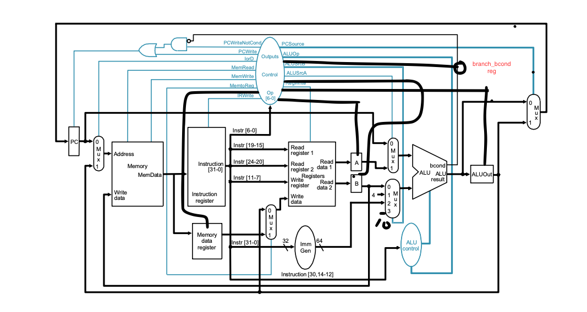
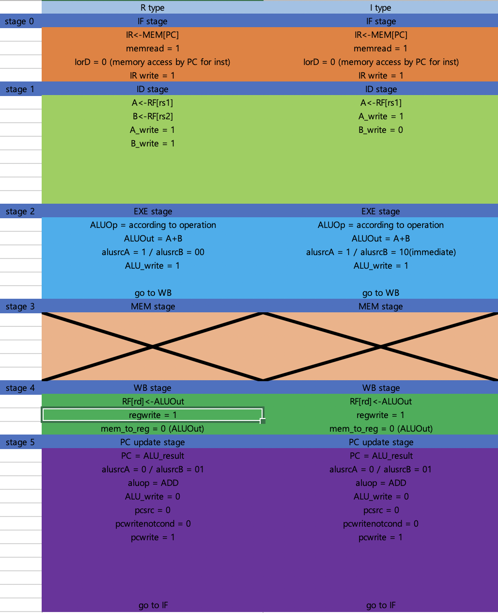
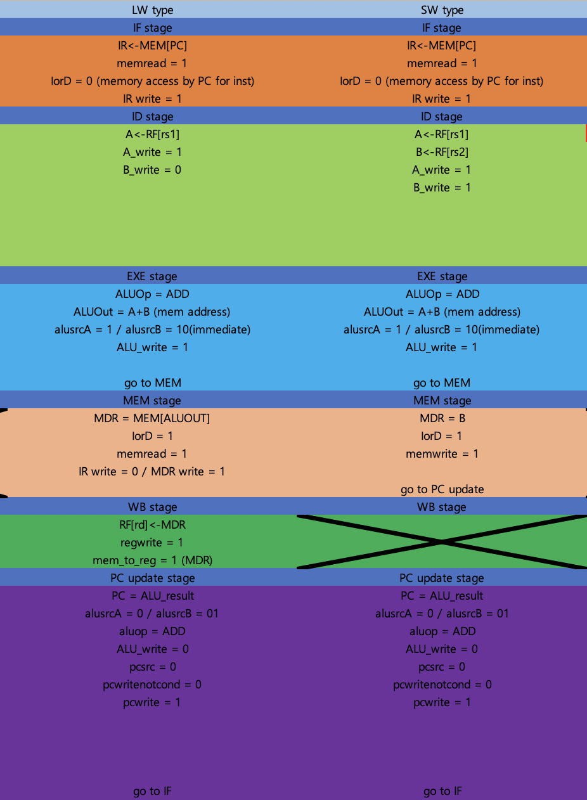
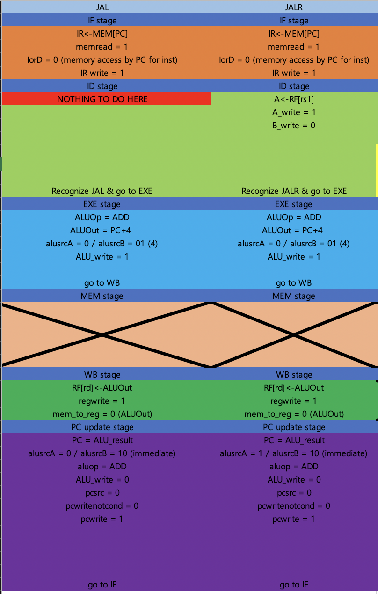
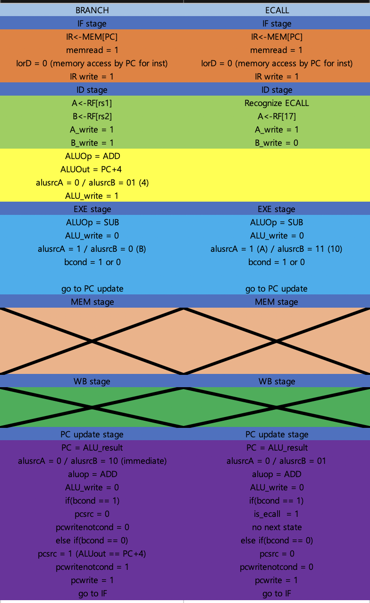
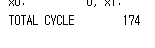
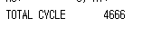

# 2022 Computer Architecture Lab 3
#### 20180085 컴퓨터공학과 송수민
## I. Introduction
    Lab 2에서는 Multi - cycle CPU를 구현한다. Multi - cycle CPU는 Single cycle cpu와 다르게 한 instruction을 여러 개의 cycle에 처리한다. 이를 함으로써 얻을 수 있는 이점은 불필요한 stage를 거치는 것을 줄일 수 있다. 한 예로, LOAD instruction의 경우 반드시 MEM stage를 거쳐야 하지만, R-type instruction의 경우 바로 WB stage로 진행하여도 무방하다. Single cycle CPU는 한 instruction을 한 cycle 안에 처리하기 때문에 R-type 또한 MEM을 거치지만 Multi cycle CPU에서는 stage별로 cycle을 나누어 필요한 stage로 직행 할 수 있다. 각 stage당 1초의 시간이 걸린다고 가정하였을 때, Single cycle CPU에서는 모든 Instruction이 5초가 걸리지만, Multi Cycle CPU에서는 R-type의 경우 4초로 줄이는 등 latency를 줄일 수 있다. 이를 처리하기 위해 각 instruction의 opcode를 판별하여 필요한 stage로 보내주는 microcontroller가 필요하다. 이에 따라 필요한 control bit 또한 single cycle cpu에서 변화가 존재한다. 이를 Design에서 서술하고자 한다.
## II. Design
    Design은 Lecture Note 6(page 18)를 토대로 하였다. 

## III. Implementation
    다음은 구현 방법이다. 
    
- 1. PC <br>
 ```verilog    
module PC(input reset, input clk, input pc_write, input pc_writenotcond, input alu_bcond, 
input [`word_size-1:0] next_pc, output reg [`word_size - 1: 0] current_pc);
    always @(posedge clk) begin
        if(reset)
            current_pc <= `word_size'd0;
        else begin
            if((!alu_bcond && pc_writenotcond) || pc_write) 
                current_pc <= next_pc;   
        end
    end 
endmodule
```
> PC는 clock이 posedge일 때 synchronously update하도록 구현하였다. 모듈 구현 방법은 Single cycle CPU와 크게 다른점은 없으며, update할 때 pc_write, alu_bcond에 관한 control bit에 따라 통제된다는 점이 차이점이다. 
- 2. RegisterFile, Memory, Immediate
> RegisterFile,Memory는 제공된 것을 사용하였으므로 생략한다. 단, Memory의 경우 multi cycle CPU의 경우 single cycle CPU와 다르게 통합된 memory를 사용하여 redundancy를 줄였다. 이로 인해 instruction / memory data를 구분해주는 control bit가 추가되었다. Immediate의 경우 Single cycle cpu와 같은 module을 그대로 사용하였다.
- 3. ALU
```verilog
module ALU(input [3:0] alu_op, input [`word_size-1:0] alu_in_1,
input [`word_size-1:0] alu_in_2,output reg [`word_size-1:0] alu_result,output reg alu_bcond);
    always @(*) begin
        case(alu_op)
            `ALU_ADD : alu_result = alu_in_1 + alu_in_2;
            `ALU_SUB : alu_result = alu_in_1 - alu_in_2;
            `ALU_SLL: alu_result = alu_in_1 << alu_in_2[4:0];
            `ALU_XOR: alu_result = alu_in_1 ^ alu_in_2;
            `ALU_OR: alu_result = alu_in_1 | alu_in_2;
            `ALU_AND: alu_result = alu_in_1 & alu_in_2;
            `ALU_SRL: alu_result = alu_in_1 >> alu_in_2[4:0];
            `ALU_BEQ: begin
                alu_result = alu_in_1 - alu_in_2;
                if(alu_result == 0)
                    alu_bcond = 1;
                else
                    alu_bcond = 0;
            end
            `ALU_BNE: begin
                alu_result = alu_in_1 - alu_in_2;
                if(alu_result != 0)
                    alu_bcond = 1;
                else
                    alu_bcond = 0;
            end
            `ALU_BLT: begin
                alu_result = alu_in_1 - alu_in_2;
                if($signed(alu_result)<0)
                    alu_bcond = 1;
                else
                    alu_bcond = 0;
            end
            `ALU_BGE: begin
                alu_result = alu_in_1 - alu_in_2;
                if($signed(alu_result)>=0)
                    alu_bcond = 1;
                else
                    alu_bcond = 0;
            end
        endcase

    end
endmodule

module ALUControlUnit(input [6:0] part_of_inst, input [31:0] inst, output reg [3:0] alu_op);
    //inst[10] -> funct7 / inst[9:7] funct3 / inst[6:0] opcode
    always @(*) begin
        case(part_of_inst[6:0])
            `ARITHMETIC: begin 
                if(inst[30])
                    alu_op = `ALU_SUB;
                else begin
                    case(inst[14:12])
                        `FUNCT3_ADD: alu_op = `ALU_ADD;
                        `FUNCT3_SLL: alu_op = `ALU_SLL;
                        `FUNCT3_XOR: alu_op = `ALU_XOR;
                        `FUNCT3_OR: alu_op = `ALU_OR;
                        `FUNCT3_AND: alu_op = `ALU_AND;
                        `FUNCT3_SRL: alu_op = `ALU_SRL;
                    endcase
                end
            end
            `ARITHMETIC_IMM: begin
                case(inst[14:12]) 
                    `FUNCT3_ADD: alu_op = `ALU_ADD;
                    `FUNCT3_SLL: alu_op = `ALU_SLL;
                    `FUNCT3_XOR: alu_op = `ALU_XOR;
                    `FUNCT3_OR: alu_op = `ALU_OR;
                    `FUNCT3_AND: alu_op = `ALU_AND;
                    `FUNCT3_SRL: alu_op = `ALU_SRL;
                endcase
            end
            `LOAD: alu_op = `ALU_ADD;
            `STORE: alu_op = `ALU_ADD;
            `JALR: alu_op = `ALU_ADD;
            `BRANCH: begin
                case(inst[14:12])
                    `FUNCT3_BEQ: alu_op = `ALU_BEQ;
                    `FUNCT3_BNE: alu_op = `ALU_BNE;
                    `FUNCT3_BLT: alu_op = `ALU_BLT;
                    `FUNCT3_BGE: alu_op = `ALU_BGE;
                endcase
            end
            `TEMP: alu_op = `ALU_ADD;  //ADDED
            `ECALL: alu_op = `ALU_BEQ; // ADDED
        endcase
    end
endmodule
```
> ALU.v에는 alu module과 alu control module을 함께 구현하였다. <br>
> 1. ALUControlUnit Module <br>
> ALUControlunit 또한 Single cycle CPU 구현과 크게 변화시키지 않았다. 단, Input의 추가와 2개의 case 추가가 있다. 추후에 서술할 control에서 EXE stage가 아닌 타 stage에서 ADD계산을 하는 경우 Ecall의 경우 x17과 10을 비교하는 operation이 있는데 이를 위해 TEMP, ECALL case가 추가되었다. 또한, module을 크게 변화시키지 않고 사용하기 위해 opcode를 받는 input을 하나 추가하였다.
> <br>
> 2. ALU <br>
> ALU는 single cycle cpu와 동일하다.
- 4. ControlUnit
```verilog
 module ControlUnit(input clk, input reset, input [6:0] part_of_inst,input bcond_branch,output reg mem_to_reg, output reg mem_write, output reg mem_read, output reg IorD,
  output reg pc_write, output reg pc_src, output reg pc_writenotcond, output reg ir_write, output reg mdr_write, output reg write_enable,
  output reg A_write, output reg B_write, output reg ALUOut_write, output reg alu_src_A, output reg [1:0] alu_src_B,
  output reg [6:0] alu_op_type,output reg is_ecall, output reg bcond_write);
    reg [2:0] state, next_state;
    always @(posedge clk) begin
      if(reset)
        state <= 3'b000;
      else
        state <= next_state;
    end
    always @(*) begin
      case(state)
        `IF: begin
          mem_to_reg = 0 ; mem_write = 0; mem_read = 1; IorD = 0; pc_write = 0; pc_writenotcond = 0; ir_write = 1; mdr_write = 0; write_enable = 0;
          A_write = 0; B_write = 0; ALUOut_write = 0; is_ecall = 0; bcond_write = 0;
          next_state = `ID;
        end
        `ID: begin
          if(part_of_inst != `JAL) begin
          mem_to_reg = 0 ; mem_write = 0; mem_read = 0; IorD = 0; pc_write = 0; pc_writenotcond = 0; ir_write = 0; mdr_write = 0; write_enable = 0;
          A_write = 1; B_write = 1; ALUOut_write = 0; is_ecall = 0; bcond_write = 0;
          end
          if(part_of_inst == `BRANCH) begin
            alu_src_A = 0;
            alu_src_B = 2'b10;
            alu_op_type = `TEMP;
            ALUOut_write = 1;
          end
          if(part_of_inst == `ECALL) begin
            A_write = 1;
            B_write = 0;
          end
          next_state = `EXE;
        end
        `EXE: begin
          is_ecall = 0; pc_write = 0; pc_writenotcond = 0; ir_write = 0; mdr_write = 0;
          A_write = 0; B_write = 0; mem_read = 0; mem_write = 0; write_enable = 0; bcond_write = 0;
          IorD = 0;
          case(part_of_inst)
            `ARITHMETIC: begin
              alu_src_A = 1;
              alu_src_B = 0;
              ALUOut_write = 1;
              alu_op_type = `ARITHMETIC;
              next_state = `WB;
            end
            `ARITHMETIC_IMM: begin
              alu_src_A = 1;
              alu_src_B = 2'b10;
              ALUOut_write = 1;
              alu_op_type = `ARITHMETIC_IMM;
              next_state = `WB;
            end
            `LOAD: begin
              alu_src_A = 1;
              alu_src_B = 2'b10;
              ALUOut_write = 1;
              alu_op_type = `LOAD;
              next_state = `MEM;
            end
            `STORE: begin
              alu_src_A = 1;
              alu_src_B = 2'b10;
              ALUOut_write = 1;
              alu_op_type = `STORE;
              next_state = `MEM;
            end
            `JAL,`JALR: begin
              alu_src_A = 0;
              alu_src_B = 2'b01;
              alu_op_type = `TEMP;
              ALUOut_write = 1;
              next_state = `WB;
            end
            `BRANCH: begin
              alu_src_A = 1;
              alu_src_B = 2'b00;
              alu_op_type = `BRANCH;
              bcond_write = 1;
              ALUOut_write = 0;
              next_state = `PCUpdate;
            end
            `ECALL: begin
              alu_src_A = 1;
              alu_src_B = 2'b11;
              alu_op_type = `ECALL;
              bcond_write = 1;
              ALUOut_write = 0;
              next_state = `PCUpdate;
            end
          endcase
        end
        `MEM: begin 
          is_ecall = 0; pc_write = 0; pc_writenotcond = 0; ir_write =0;
          A_write = 0; B_write = 0; IorD = 1; ALUOut_write = 0; write_enable = 0; bcond_write = 0;
          case(part_of_inst)
          `LOAD: begin 
              mdr_write = 1;
              mem_read = 1;
              next_state = `WB;
          end
          `STORE: begin
            mem_write = 1;
            mdr_write =0;
            next_state = `PCUpdate;
          end
          endcase
        end
        `WB: begin
          is_ecall = 0; pc_write = 0; pc_writenotcond = 0; ir_write =0; mdr_write = 0;
          A_write = 0; B_write = 0; IorD = 0; ALUOut_write = 0; mem_read = 0; mem_write = 0; bcond_write = 0;
          write_enable = 1;
          case(part_of_inst)
          `ARITHMETIC,`ARITHMETIC_IMM,`JAL,`JALR: begin
            mem_to_reg = 0;
          end
          `LOAD: begin
            mem_to_reg = 1;
          end
          endcase
          next_state =`PCUpdate;
        end
        `PCUpdate: begin
          ir_write = 0; mdr_write = 0;
          A_write = 0; B_write = 0; IorD =0; mem_read = 0; mem_write = 0;
          write_enable = 0; bcond_write = 0;
          case(part_of_inst)
            `ARITHMETIC,`ARITHMETIC_IMM,`LOAD,`STORE: begin
              alu_src_A = 0;
              alu_src_B = 2'b01;
              alu_op_type = `TEMP;
              ALUOut_write = 0;
              pc_src = 0;
              pc_writenotcond = 0;
              pc_write = 1;
              next_state = `IF;
            end
            `JAL: begin
              alu_src_A = 0;
              alu_src_B = 2'b10;
              alu_op_type = `TEMP;
              ALUOut_write = 0;
              pc_src = 0;
              pc_writenotcond = 0;
              pc_write = 1;
              next_state = `IF;
            end
            `JALR: begin
              alu_src_A = 1;
              alu_src_B = 2'b10;
              alu_op_type = `TEMP;
              ALUOut_write = 0;
              pc_src = 0;
              pc_writenotcond = 0;
              pc_write = 1;
              next_state = `IF;
            end
            `BRANCH: begin 
              alu_src_A = 0;
              alu_src_B = 2'b01; // pc+4
              alu_op_type = `TEMP;
              ALUOut_write = 0;
              if(bcond_branch) begin
                pc_src = 1;
                pc_writenotcond = 0;
              end
              else begin
                pc_src = 0;
                pc_writenotcond = 1;
              end
              pc_write = 1;
              next_state = `IF;
            end
            `ECALL: begin
              alu_src_A = 0;
              alu_src_B = 2'b01;
              alu_op_type = `TEMP;
              ALUOut_write = 0;
              if(bcond_branch == 0) begin
                pc_src = 0;
                pc_writenotcond = 1;
                pc_write = 1;
                next_state = `IF;
              end
              else
                is_ecall = 1;
            end
          endcase
        end
      endcase
    end
  endmodule
```
> Control.v에서는 microcode controller의 역할을 수행한다. 먼저, cycle마다 각 stage들은 posedge에 update 될 수 있도록 synchronously하게 구현하였다. Module 시작 부분이 해당 code이다. Stage는 opcode.v에 3bit로 하여 IF, ID, EXE, MEM, WB, PCUpdate로 define 해두었다. 각 stage에서 상황에 맞게 next_state에 define value를 넣어준다. 이 파일에서 Lecture note에 있는 control bit를 모두 생성하는데, 여기서 몇가지의 control bit를 추가하였다. 추가한 control bit는 각 register에 값을 write 할 수 있게 통제하는 control bit이다. 이 값이 1일 때만 해당 register에 값을 write할 수 있다. 이 과정들은 항상 동작하여야 하므로 always 구문에 asynchronously하게 구현하였다. 아래는 각 instruction마다의 microcode controller를 Excel로 표현한 것이다. <br>


> R-type, I-type instruction의 경우 MEM stage를 거치지 않고 EXE stage에서 바로 WB stage로 넘어가게 구현한다. 이때, 다음 pc의 값을 계산하기 위해 구현되어 있는 ALU를 PCUpdate에서 재사용하게 되는데, 이 값은 aluout register에 저장하지 않고 alu_result로 바로 mux를 거쳐 pc register로 보내지게 된다. 이때 ALUOut_write 값을 조정하여 위의 사항을 통제한다.
> <br>


> Load instruction의 경우 모든 stage를 사용한다. ID stage에서 load insturction은 rs2_dout을 사용하지 않고 Immediate를 사용하기 때문에 B_write를 0으로 해 B register에 작성되는 경우를 방지한다. EXE stage에서는 ALU에 rs1 값과 immediate값이 알맞게 들어가게 source value를 후에 mux로 통제하기 위해 control bit를 정해준다. 본 과제에서는 alusrcA에서 0은 pc, 1은 rs1_dout이고, alusrcB에서 0은 rs2_dout, 1은 pc+4를 위한 4, 2는 immediate, 3은 ecall x17 register 값 비교를 위한 10이 들어간다. MEM stage에서 data memory에 접근하기 위해 IorD 값을 1로 설정해준다. IR에는 write되면 안되므로 0으로, MDR에 써져야 하므로 1로 통제해준다. WB stage에서 registerfile에 들어가는 값이 aluout vs MDR로 갈리는데 MDR 값이 들어가야 하므로 1로 설정해준다. <br>
> Store instruction의 경우 WB stage에 진입하지 않는다. MEM stage에서 memory에 write하고 바로 PCUpdate로 이동한다.
> <br>


> JAL의 경우 ID stage에서 JAL인것을 파악하고 EXE stage로 넘어간다. 구현은 JAL인 경우 별도의 처리 없이 바로 EXE로 넘어가게 하였다. ALU reuse를 위해 EXE stage에서 return address인 pc+4를 계산하고 이를 ALUOut에 저장한다. 이후 WB stage로 넘어가고, 여기서 return address를 register에 저장한다. PCUpdate로 넘어가서 Jump할 address를 계산한다. 위 상황에 알맞게 control bit를 지정한다.<br>
> JALR에서는 rs1의 값이 필요하므로 ID stage에서 A_write 값을 1로 설정하고, immediate를 사용하기에 B_write는 0으로 설정한다. EXE,WB는 JAL과 동일하며, PCUpdate에서 alusrcA를 register value로 설정해준다.
> <br>


> Branch instruction에서는 ID stage에서 ALU 계산이 필요하게 설계하였다. 그 이유는 ALU는 한 stage에서 하나의 값을 도출할 수 밖에 없는데, branch instruction은 jump target address, pc+4 address, branch condition 총 3개의 ALU 계산이 필요하다. 따라서, Branch임을 파악 할 수 있는 ID stage부터 모두 ALU 계산을 해주어야 위 3개의 계산이 모두 가능하였다. ID stage에서는 pc+4, EXE stage에서는 branch condition 계산, PCUpdate에서는 Jump target address를 계산하였다. 이 과정에서 기존의 datapath에서 EXE stage에서 계산한 bcond값을 저장할 register, 이 register의 write를 통제하는 control bit가 추가 되었다. 이 값들을 계산하고, PCUpdate에서 bcond에 따라 pcsrc를 정하였다. <br>
> Ecall의 경우 ECALL을 파악 할 수 있는 ID stage부터 별도의 통제를 시작하는데, rs1값을 x17로 고정하고 EXE stage에서 alusrcB값을 10으로 통제한다. 이후 EXE에서 10과 x17의 비교값을 register에 저장하고, PCUpdate로 넘어가서 값이 같다면 다음 state를 지정하지 않고 is_ecall을 1로 설정, 다르다면 PCUpdate에서 계산한 pc+4로 update하고 IF stage로 넘어간다.
- 5. CPU
```verilog
assign is_halted = is_ecall;
  always @(*) begin
    if(IR[6:0] == `ECALL) 
      rs1 = 17; // for ECALL
    else
      rs1 = IR[19:15];
    if(alu_src_A == 0)
      in_1 = current_pc;
    else
      in_1 = A;
    if(alu_src_B == 2'b00)
      in_2 = B;
    else if(alu_src_B == 2'b01)
      in_2 = 4;
    else if(alu_src_B == 2'b10)
      in_2 = immediate;
    else
      in_2 = 10; // for ECALL comparision (x17 == 10?)
    if(IorD == 0)
      addr = current_pc;
    else
      addr = ALUOut;
    if(mem_to_reg == 0)   
      rd_din = ALUOut;
    else 
      rd_din = MDR;
    if(pc_src == 0)
      next_pc = alu_result;
    else
      next_pc = ALUOut;

  end
  always @(posedge clk) begin
    if(reset)begin
      IR <=0;
      MDR <=0;
      A <= 0;
      B <= 0;
      ALUOut <= 0;
    end
    else begin
      if(A_write) A <= rs1_dout;
      if(B_write) B <= rs2_dout;
      if(ALUOut_write) ALUOut <= alu_result;
      if(bcond_write) bcond_branch <= alu_bcond;
      if(ir_write) IR <= dout;
      if(mdr_write) MDR <= dout;
    end
  end
```
> 이전 Single cycle cpu에 비해 code가 간단해졌다. 먼저 각 register들은 한 사이클이 지날 때 마다 각 register control bit에 따라 clock synchronously하게 update된다. Asynchronously하게 각 wire들에 알맞은 값이 들어가게 하기 위한 multiplexer 기능을 if-else로 구현하였다. 첫 줄에 opcode가 ecall이면 register number을 17로 고정하였다.
- 6. opcodes
```verilog
...
`define ECALL           7'b1110011
`define TEMP            7'b1111111
///STATE
`define IF 3'b000
`define ID 3'b001
`define EXE 3'b010
`define MEM 3'b011
`define WB 3'b100
`define PCUpdate 3'b101
```
> 기존 single cycle cpu에서 위와 같은 constant를 추가로 선언하였다. TEMP는 원래의 EXE계산과 달리 단지 address계산을 위한 ADD연산을 별도로 처리하기 위해 추가하였다.
## 4. Discussion
1. Microcode Controller
> 이번 과제는 Microcode controller를 제외하고는 single cycle CPU module을 살짝 수정하는 정도여서 controller를 구현하는 것이 80%였던 과제인 듯 하다. 처음에는 각 stage마다 처리할 일을 생각하며 구현하였더니 혼동이 되었다. 시각을 바꾸어서 execl 표에 instruction 별로 필요한 stage, 필요한 control을 생각하며 정리하니 구현이 용이하였다. <br>
2. Bcond Register
> Modelsim이 익숙하여 modelsim으로 시뮬레이션을 돌려 봤을 때는 정확히 나오던 register 값이 vivado에서는 부정확하게 나왔었다. 원인을 찾아보니, posedge 때 bcond값이 exe stage에서 계산된 값이 유지되어야 하는데, 원인 모를 이유로 PCUpdate에서 pc+4 계산 토대로 변경되었다. Code를 살펴본 결과 따로 처리해주지 않은 것은 없었지만, default를 사용하지 않은 부분이 있어 이를 통제하기 위해 bcond 값을 저장하는 register와 이 Register에 write를 통제하는 control bit를 추가하였다. 원래는 alu_bcond 값을 바로 control unit으로 넣어주었는데, alu에서 나온 값을 bcond_branch에 저장하고 이후 write 할 수 없게 control bit를 0으로 통제하였다. 이후 이 값을 control unit의 Input으로 넣어 이 값을 토대로 통제하게 구현하여 해결하였다. 아직 원인을 명확히는 모르겠지만, lab guidence에 나와 있는 high impedence 이러한 경우가 아닐까 생각해 보았다. Default, else를 다음 lab에서는 명확히 하고자 한다. <br>
## 5. Conclusion
    이번 과제를 통해 multi cycle cpu를 구현해 보았다. 구현은 single cycle cpu + microcode controller 느낌이어서 그렇게 어렵지는 않았지만, 이번 과제를 통해 다음 과제인 pipeline 과제 수행 시 각 instruction마다 state를 변경하는 방법, Control bit를 설정하는 방법을 조금 유추하게 되었다. 하지만, 아직 instruction을 한 cycle마다 Fetch하는 것은 조금 더 고민이 필요할 듯 하다. 아래는 각 test case마다의 cycle 수이다.


